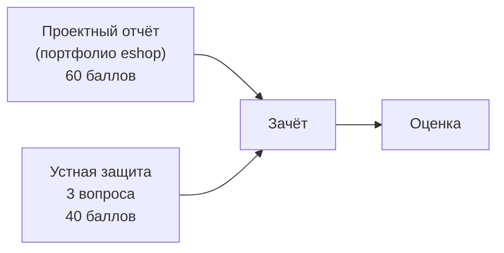

# Форма и критерии зачёта

**Дисциплина:** Администрирование баз данных  
**Форма контроля:** Зачёт (с оценкой)  
**Неделя:** 13 (последнее занятие курса)

---

## Структура зачёта

Зачёт состоит из двух частей: **проектный отчёт** и **устная защита**. Обе части сдаются в одно занятие.

---

## Часть 1. Проектный отчёт (60 баллов)

Отчёт — сводный документ по проекту **eshop**, накопленный по итогам лабораторных работ. Сдаётся в виде единого Markdown-файла `eshop_project_report.md` (структура — см. лаб. 10).

| Раздел отчёта                     | Баллы | Критерий                                                                                    |
| --------------------------------- | ----- | ------------------------------------------------------------------------------------------- |
| ERD (актуальная схема eshop)      | 8     | Mermaid-диаграмма содержит все таблицы; кардинальности верны                                |
| Ролевая модель                    | 8     | Все 4 роли описаны; таблица привилегий заполнена; RLS-политика объяснена                    |
| Регламент резервного копирования  | 8     | Таблица из лаб. 03 заполнена (4 уровня, частота, хранение); RPO/RTO указаны                 |
| Мониторинг (отчёт о состоянии БД) | 6     | cache hit ratio и dead_pct заполнены; пороги для алертов сформулированы                     |
| Анализ запросов (EXPLAIN)         | 8     | Таблица «до/после индекса» из лаб. 06 заполнена; причина ускорения объяснена                |
| Миграции Flyway                   | 8     | `flyway info` скриншот / вывод: все V001–V008 Applied; Migration Plan V003 приложен         |
| ИБ-чек-лист                       | 6     | `ib_checklist.md` заполнен; категория ПДн и меры по 152-ФЗ указаны                          |
| Rollback и zero-downtime          | 8     | Таблица паттернов заполнена; описан инцидент с V005 и способ решения через forward rollback |

> **Подача:** файл `eshop_project_report.md` отправляется преподавателю в LMS до начала занятия. Опоздавшие работы принимаются со штрафом −10 баллов за каждое незачтённое занятие.

---

## Часть 2. Устная защита (40 баллов)

Преподаватель задаёт **3 вопроса** из банка ниже. Студент отвечает устно; при необходимости — показывает команды в терминале или SQL в DBeaver.

**Оценка каждого вопроса:**
- 13–14 баллов: полный ответ с пониманием причин
- 10–12 баллов: верный ответ, но поверхностный
- 6–9 баллов: частичный ответ
- 0–5 баллов: неверный ответ

### Банк вопросов

#### Блок А. Архитектура и установка
1. Что такое WAL? Зачем PostgreSQL записывает изменения дважды? Как WAL связан с PITR?
2. Объясните структуру PGDATA: что хранится в `base/`, `pg_wal/`, `pg_hba.conf`, `postgresql.auto.conf`.
3. Чем `postmaster` отличается от `backend`? Сколько backend-процессов будет при 50 соединениях?
4. Что такое MVCC? Почему `DELETE` не освобождает место сразу?

#### Блок Б. Роли и доступ
5. Объясните иерархию привилегий: `CONNECT` → `USAGE` → `SELECT`. Что будет, если выдать `SELECT`, но не `USAGE`?
6. Что такое `ALTER DEFAULT PRIVILEGES` и чем оно отличается от `GRANT ON ALL TABLES`?
7. Объясните RLS: что происходит при `ALTER TABLE ... ENABLE ROW LEVEL SECURITY` без политик?
8. Как работает `scram-sha-256` в `pg_hba.conf`? Почему `trust` опасен?

#### Блок В. Резервное копирование и восстановление
9. Чем `pg_dump` отличается от `pg_basebackup`? Когда какой инструмент использовать?
10. Что нужно сделать для PITR? Перечислите шаги: что в `postgresql.conf`, что в PGDATA.
11. Зачем нужен `pg_dumpall --globals-only`? Почему без него `pg_restore` может завершиться с ошибкой?
12. Что такое RPO и RTO? Как они связаны с выбором метода резервного копирования?

#### Блок Г. Мониторинг и оптимизация
13. Какие признаки в `pg_stat_activity` указывают на блокировку? Как снять блокировку?
14. Что такое `dead_pct` и как его уменьшить? Что будет, если отключить autovacuum?
15. Объясните: что означает `Seq Scan` vs `Index Scan` в EXPLAIN. Когда планировщик предпочтёт Seq Scan?
16. Что такое `work_mem`? Почему нельзя поставить 1 GB глобально при 50 соединениях?

#### Блок Д. Миграции и rollback
17. Зачем Flyway использует `flyway_schema_history`? Что произойдёт, если изменить уже применённый V-файл?
18. Объясните `forward rollback`: почему он предпочтительнее undo-скрипта?
19. Почему `ALTER TABLE orders ADD COLUMN val TEXT NOT NULL` без DEFAULT может заблокировать таблицу (до PG11)?
20. Почему `flyway clean` должен быть отключён (`cleanDisabled=true`) в production?

#### Блок Е. ИБ
21. Что аудирует pgAudit при `pgaudit.log = 'write, ddl, role'`? Приведите пример строки из лога.
22. Чем `ssl=on` + `hostssl` в `pg_hba.conf` лучше, чем просто `ssl=on`?
23. Что такое персональные данные по 152-ФЗ? К какой категории относятся ФИО + email + телефон в eshop?

---

## Шкала оценок

| Итоговый балл (max 100) | Оценка    |
|-------------------------|-----------|
| 85–100                  | Отлично   |
| 70–84                   | Хорошо    |
| 55–69                   | Удовл.    |
| < 55                    | Не зачтено|

> Зачёт без оценки: при итоговом балле ≥ 55 студент получает «зачтено» без оценки в ведомость (если программа предусматривает только зачёт/незачёт).

---

## Условия допуска к зачёту

К зачёту допускаются студенты, выполнившие чек-листы **всех 10** лабораторных работ. Незачтённые работы закрываются на доп. занятии до зачёта.

---

## Материалы, разрешённые на зачёте

- Собственный `eshop_project_report.md` (открытый в редакторе).
- DBeaver с подключением к локальной БД `eshop`.
- Терминал с доступом к psql, flyway.
- **Запрещено:** интернет, ИИ-ассистенты, чужие материалы.
