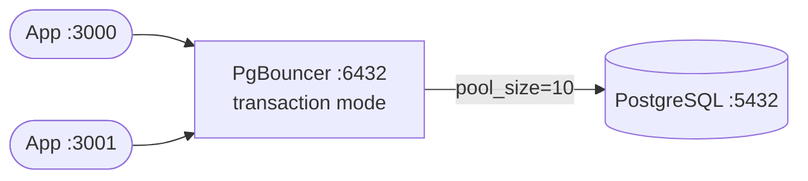
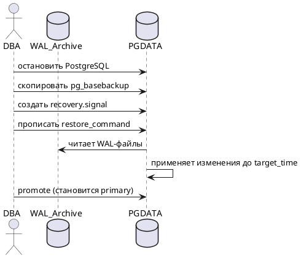

# Темы докладов и требования к оформлению

**Дисциплина:** Администрирование баз данных  
**Форма:** Индивидуальный доклад (15 мин выступление + 5 мин вопросы)  
**Количество тем:** 42

---

## Требования к докладу

### Обязательный технический стек

| Элемент        | Обязательно                                                                           |
|----------------|---------------------------------------------------------------------------------------|
| Репозиторий    | GitHub или GitVerse (публичный); ссылка сдаётся до доклада                            |
| Формат текста  | Markdown (`.md`) — всё содержимое доклада                                             |
| Диаграммы      | **Mermaid** (встроен в GitHub/GitVerse) И **PlantUML** — по одной диаграмме каждого  |
| ASCII-схемы    | Минимум одна ASCII-схема (архитектура, схема данных или flow)                         |
| Примеры кода   | SQL/bash/YAML с блоками ``` ``` — без скриншотов из IDE                              |
| Демонстрация   | Развёртывание на локальной машине или Docker — показать работающую систему            |

### Структура репозитория

```
report-<тема>/
├── README.md          ← главный файл: весь доклад
├── docker-compose.yml ← или Dockerfile (если применимо)
├── sql/
│   └── demo.sql       ← демонстрационный скрипт
├── diagrams/
│   ├── arch.puml      ← PlantUML-диаграмма
│   └── flow.md        ← Mermaid в отдельном файле (опционально)
└── screenshots/
    └── *.png          ← снимки работающей системы
```

### Структура README.md (обязательная)

```markdown
# Название темы

## 1. Цель и актуальность
Зачем это нужно; какую проблему решает.

## 2. Архитектура
ASCII-схема + Mermaid-диаграмма.

## 3. Установка и развёртывание
Команды Docker / apt / brew. Рабочий docker-compose.yml.

## 4. Демонстрация
SQL-запросы или команды с реальным выводом.

## 5. PlantUML-диаграмма
Диаграмма последовательности / компонентная / ERD в PlantUML.

## 6. Сравнение с альтернативами
Таблица: Feature X | Данная технология | Альтернатива 1 | Альтернатива 2.

## 7. Ограничения и когда НЕ применять

## 8. Ссылки
```

### Критерии оценки

| Критерий                                       | Баллы |
|------------------------------------------------|-------|
| Репозиторий доступен; структура соблюдена      |    5  |
| Mermaid-диаграмма корректна и информативна     |    5  |
| PlantUML-диаграмма корректна                   |    5  |
| ASCII-схема читаема                            |    5  |
| Демонстрация работает (live или видео)         |   15  |
| SQL/bash-примеры реальные, запускаются         |   15  |
| Сравнение с альтернативами заполнено           |   10  |
| Устные ответы на вопросы                       |   40  |
| **Итого**                                      | **100** |

---

## Темы докладов

### Блок A. Расширения PostgreSQL

| № | Тема                                                                                   |
|---|----------------------------------------------------------------------------------------|
| 1  | **PostGIS**: геопространственные данные в PostgreSQL. ST_Distance, ST_Contains, индексы GiST |
| 2  | **pgRouting**: маршрутизация на графе поверх PostGIS. Алгоритм Дейкстры в SQL         |
| 3  | **pgvector**: векторные эмбеддинги в PostgreSQL. Семантический поиск и RAG-архитектура |
| 4  | **pg_partman**: автоматическое партиционирование таблиц по времени и хэшу             |
| 5  | **TimescaleDB**: временны́е ряды в PostgreSQL. Hypertable, continuous aggregate, retention policy |
| 6  | **Citus**: горизонтальное масштабирование PostgreSQL. Sharding, distributed queries    |
| 7  | **pgAudit**: аудит SQL-операций. Session audit, object audit, интеграция с SIEM        |
| 8  | **pgBadger**: анализ лог-файлов PostgreSQL. Настройка log_line_prefix, HTML-отчёт     |
| 9  | **PgBouncer**: connection pooler. Session / transaction / statement режимы, pgbouncer.ini |
| 10 | **pg_cron**: планировщик задач внутри PostgreSQL. Расписание SQL-jobs через cron-синтаксис |
| 11 | **pg_stat_statements**: профилирование запросов. total_exec_time, stddev, блокировки  |
| 12 | **pgcrypto**: шифрование данных в PostgreSQL. pgp_sym_encrypt, gen_random_uuid         |
| 13 | **PostgREST**: автоматический REST API из схемы PostgreSQL. Авторизация через JWT/RLS |

### Блок B. Производительность и оптимизация

| №  | Тема                                                                                   |
|----|----------------------------------------------------------------------------------------|
| 14 | **EXPLAIN ANALYZE**: читаем план выполнения запроса. Seq Scan, Hash Join, Nested Loop  |
| 15 | **Индексы PostgreSQL**: B-tree, GIN, GiST, BRIN, Hash — когда какой применять          |
| 16 | **Партиционирование**: Range, List, Hash. Partition pruning и его влияние на план       |
| 17 | **Параллельные запросы PostgreSQL**: parallel_workers, max_parallel_workers, plan nodes |
| 18 | **VACUUM и autovacuum**: MVCC, bloat, настройка autovacuum_vacuum_scale_factor          |
| 19 | **Кэш PostgreSQL**: shared_buffers, work_mem, pg_buffercache, cache hit ratio           |
| 20 | **pgBench**: нагрузочное тестирование PostgreSQL. TPS, latency, профили нагрузки       |

### Блок C. Отказоустойчивость и репликация

| №  | Тема                                                                                   |
|----|----------------------------------------------------------------------------------------|
| 21 | **Потоковая репликация PostgreSQL**: WAL, pg_stat_replication, replay_lag, failover     |
| 22 | **Patroni**: автоматический failover PostgreSQL. Patroni + etcd + HAProxy              |
| 23 | **Логическая репликация**: CREATE PUBLICATION / SUBSCRIPTION, межверсионная миграция   |
| 24 | **pgBouncer + Keepalived**: HA для connection pooler. VIP, VRRP, failover PgBouncer    |
| 25 | **Barman**: централизованное управление бэкапами PostgreSQL. WAL, PITR, retention      |
| 26 | **pg_basebackup и PITR**: физический бэкап кластера, WAL-архив, recovery.signal        |

### Блок D. Безопасность и соответствие

| №  | Тема                                                                                   |
|----|----------------------------------------------------------------------------------------|
| 27 | **Row-Level Security**: мультитенантность через RLS. Политики, USING, WITH CHECK       |
| 28 | **PostgreSQL и 152-ФЗ**: категории ПДн, локализация, шифрование, pgAudit, документация |
| 29 | **SSL/TLS в PostgreSQL**: настройка ssl=on, сертификаты, hostssl в pg_hba.conf          |
| 30 | **HashiCorp Vault + PostgreSQL**: динамические секреты, ротация паролей, аудит доступа |

### Блок E. Современные СУБД и сравнения

| №  | Тема                                                                                   |
|----|----------------------------------------------------------------------------------------|
| 31 | **CockroachDB**: NewSQL, распределённые транзакции. Сравнение с PostgreSQL              |
| 32 | **ClickHouse**: аналитическая СУБД. Columnar storage, MergeTree, сравнение с PostgreSQL+TimescaleDB |
| 33 | **DuckDB**: OLAP «на ноутбуке». In-process аналитика, Parquet, сравнение с PostgreSQL  |
| 34 | **Apache Cassandra**: eventually consistent NoSQL. Когда вместо PostgreSQL             |
| 35 | **Redis как кэш перед PostgreSQL**: cache-aside, write-through, TTL, инвалидация кэша  |
| 36 | **MongoDB vs PostgreSQL JSONB**: документная модель, индексы, производительность       |

### Блок F. DevOps и инструменты

| №  | Тема                                                                                   |
|----|----------------------------------------------------------------------------------------|
| 37 | **Flyway vs Liquibase**: версионирование схемы БД, CI/CD-интеграция, rollback          |
| 38 | **PostgreSQL в Kubernetes**: StatefulSet, PVC, PodDisruptionBudget, CloudNativePG      |
| 39 | **Prometheus + Grafana + postgres_exporter**: мониторинг PostgreSQL, алерты, дашборды  |
| 40 | **pgAdmin 4 vs DBeaver vs DataGrip**: сравнение GUI-клиентов для DBA и аналитика       |
| 41 | **Экосистема расширений PostgreSQL**: матрица выбора. Когда PostGIS, pgvector, TimescaleDB, Citus — и когда лучше другая СУБД |
| 42 | **Инструменты моделирования данных**: ERD от dbdiagram.io/DBML до DBeaver и PlantUML. Reverse engineering схемы из production БД |

---

## Примеры обязательных диаграмм

### Пример Mermaid (архитектура PgBouncer)

````markdown

````

### Пример PlantUML (последовательность PITR)

````markdown

````

### Пример ASCII-схемы (HA с Patroni)

```
┌──────────────┐     ┌──────────────┐     ┌──────────────┐
│   etcd #1    │────▶│   etcd #2    │────▶│   etcd #3    │
└──────────────┘     └──────────────┘     └──────────────┘
        │                    │                    │
        └────────────────────┴────────────────────┘
                             │
              ┌──────────────┴──────────────┐
              ▼                             ▼
    ┌──────────────────┐         ┌──────────────────┐
    │  Patroni/PG      │────WAL─▶│  Patroni/PG      │
    │  PRIMARY         │         │  STANDBY          │
    └──────────────────┘         └──────────────────┘
              ▲
              │
    ┌──────────────────┐
    │     HAProxy      │
    │  :5000 / :5001   │
    └──────────────────┘
```

---

## Docker-пример для доклада (тема: pgvector)

```yaml
# docker-compose.yml
version: '3.8'
services:
  postgres:
    image: pgvector/pgvector:pg17
    environment:
      POSTGRES_PASSWORD: demo
      POSTGRES_DB: vectordb
    ports:
      - "5432:5432"
    volumes:
      - ./sql/demo.sql:/docker-entrypoint-initdb.d/demo.sql
```

```sql
-- sql/demo.sql
CREATE EXTENSION IF NOT EXISTS vector;

CREATE TABLE documents (
    id      SERIAL PRIMARY KEY,
    content TEXT,
    embedding vector(3)    -- в реальном проекте 1536 (OpenAI) или 768 (BERT)
);

INSERT INTO documents (content, embedding) VALUES
    ('PostgreSQL — объектно-реляционная СУБД', '[1,2,3]'),
    ('TimescaleDB расширяет PostgreSQL для временных рядов', '[4,5,6]'),
    ('pgvector добавляет поддержку векторного поиска', '[1,2,4]');

-- Поиск ближайших соседей (cosine distance)
SELECT content, embedding <=> '[1,2,3]'::vector AS distance
FROM   documents
ORDER  BY distance
LIMIT  3;
```

---

## Сроки и порядок защиты

| Этап                          | Срок              |
|-------------------------------|-------------------|
| Выбор темы (через преподавателя) | Неделя 3       |
| Сдача ссылки на репозиторий   | За 3 дня до доклада |
| Доклад (15 мин + 5 мин вопросы) | По расписанию недели 10–13 |
| Повторная защита (если нужно) | До конца недели 13 |
