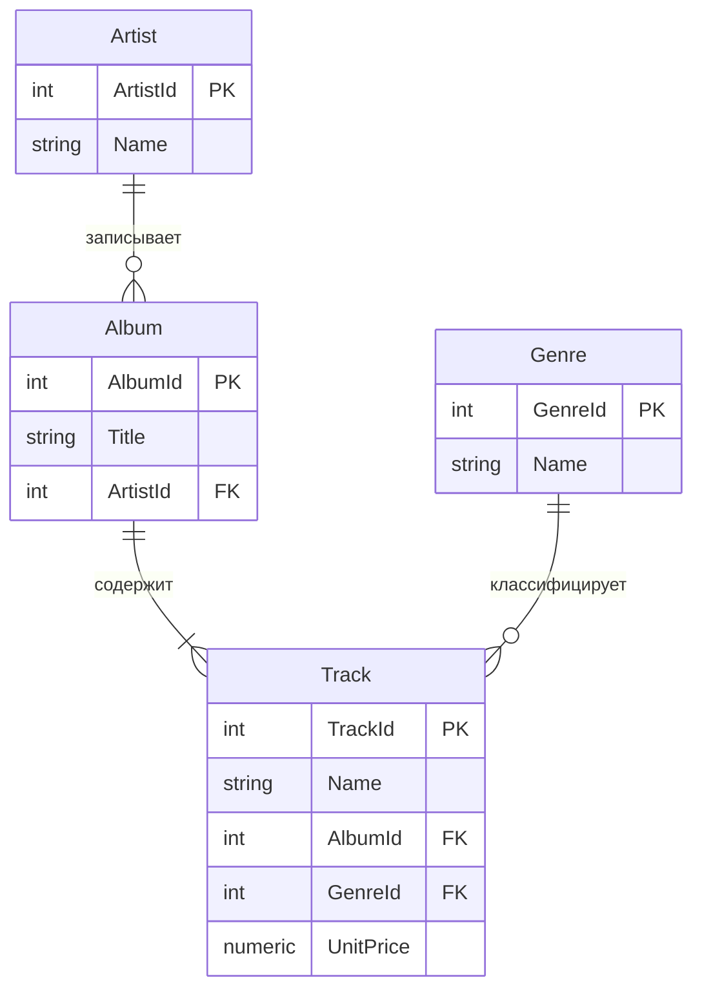

# Лабораторная работа №1
## Установка PostgreSQL и DBeaver. Первый цикл резервного копирования и восстановления
**Ориентировочное время:** 2 занятия (≈4 ак. ч.)

---

## Цель работы

Развернуть локальную среду для работы с СУБД PostgreSQL, подключиться к ней
из клиента DBeaver, создать тестовую базу данных и выполнить полный цикл
«резервное копирование → удаление → восстановление» средствами графического
интерфейса.

## Часть 0. Организационная (знакомство)

1. Несколько слов о курсе: это практический курс по администрированию баз данных на примере PostgreSQL — от установки и настройки СУБД до управления доступом, резервного копирования и восстановления, мониторинга, оптимизации запросов, отказоустойчивости и защиты данных. 
По сути, студент проходит весь жизненный цикл эксплуатации БД глазами не разработчика, а того, кто отвечает за её надёжную работу. Для специальности «Прикладная информатика» он закрывает важный пробел: выпускник умеет не только писать запросы и проектировать схемы, но и развернуть, настроить и сопровождать реальную базу — обеспечить её сохранность, 
производительность и безопасность (включая требования 152-ФЗ). Программа привязана к профстандарту 06.011 «Администратор баз данных», поэтому навыки сразу ложатся на конкретную профессиональную роль на рынке труда. 
А для профиля «системная аналитика» это ещё и понимание того, как ведёт себя слой данных под нагрузкой — что помогает грамотно проектировать и эксплуатировать информационные системы в целом.

2. Знакомство: желающие рассказывают о себе и своём опыте — работа с БД, опыт администрирования или общения с DBA, знакомые СУБД и инструменты.

---

## Часть 1. Установка ПО и подключение

### 1.1. Установка PostgreSQL

Установите последнюю **стабильную** версию PostgreSQL по инструкции (актуальные версии: <https://www.postgresql.org/support/versioning/>):

- Инструкция по установке (EDB): <https://www.enterprisedb.com/docs/supported-open-source/postgresql/installing/>

При установке запомните: **пароль суперпользователя `postgres`**, **порт**
(по умолчанию `5432`). Инсталлятор создаёт локальный экземпляр и служебную
базу `postgres`.

**Убедитесь, что сервер запущен**, прежде чем переходить к следующему шагу:

- **Windows:** Пуск → Службы (`services.msc`) → найти `postgresql-x64-NN` → статус «Выполняется».  
  Или в командной строке: `pg_ctl status -D "C:\Program Files\PostgreSQL\17\data"`
- **Linux:** `sudo pg_lsclusters` — в столбце `Status` должно быть `online`.  
  Или: `sudo systemctl status postgresql`
- **Docker:** `docker ps` — контейнер должен быть в статусе `Up`.

Для самостоятельного изучения:

- Документация PostgreSQL (текущая стабильная): <https://www.postgresql.org/docs/current/index.html>

### 1.2. Установка DBeaver

Установите последнюю версию DBeaver Community по инструкции:

- Инструкция: <https://dbeaver.com/docs/dbeaver/Installation/>
- Документация DBeaver: <https://dbeaver.com/docs/dbeaver/>

### 1.3. Тестовая база данных Chinook

Откройте по ссылке и скопируйте содержимое файла миграции:

- Скрипт: <https://raw.githubusercontent.com/lerocha/chinook-database/master/ChinookDatabase/DataSources/Chinook_PostgreSql.sql>
- Репозиторий (для самостоятельного изучения): <https://github.com/lerocha/chinook-database/tree/master>

### 1.4. Подключение DBeaver и запуск скрипта

1. Настройте соединение DBeaver с локальным сервером PostgreSQL, созданным при
   установке (хост `localhost`, порт `5432`, пользователь `postgres`, ваш пароль).
2. После успешного подключения выполните в SQL-редакторе:
   ```sql
   SELECT version();
   ```
   Убедитесь, что в ответе — установленная вами версия PostgreSQL.
3. Запустите скрипт создания тестовой базы данных.

> **Важно — типичная ошибка.** Начало скрипта Chinook содержит команды
> `DROP DATABASE ...; CREATE DATABASE ...; \c chinook;`. Если вставить весь
> скрипт целиком в SQL-редактор DBeaver, будут ошибки: `\c` — это команда
> клиента `psql`, DBeaver её не понимает, а `CREATE DATABASE` не выполняется
> внутри транзакции. Как сделать правильно (любой из вариантов):
>
> - **Через DBeaver:** сначала создайте пустую базу вручную
>   (правый клик по `Databases` → **Create New Database** → имя `chinook`),
>   подключитесь к ней и выполните скрипт **без первых трёх строк**
>   (DROP / CREATE / `\c`).
> - **Через psql:** выполнить файл целиком командой
>   `psql -U postgres -f Chinook_PostgreSql.sql` — тогда работают все команды,
>   включая `\c`.

**Успех этапа:** в базе `chinook` появились таблицы (`artist`, `album`, `track`,
`invoice` и др.) и данные. Обновите дерево объектов клавишей **F5**.

---

## Часть 2. Резервное копирование, удаление и восстановление (через DBeaver)

> **Предпосылка (сделать один раз).** Кнопки Dump/Restore в DBeaver не содержат
> утилит `pg_dump`/`pg_restore` — DBeaver вызывает их из установленного
> PostgreSQL. Поэтому укажите путь к «родному клиенту»: свойства подключения →
> **Local Client** (путь к папке `bin` установленного PostgreSQL). Без этого
> при нажатии **Start** появится ошибка вида «pg_dump not found».
>
> Документация DBeaver — Backup and restore:
> <https://dbeaver.com/docs/dbeaver/Backup-Restore/>

### 2.1. Создайте бэкап созданной базы данных

Правый клик по базе `chinook` → **Tools → Dump database**.
Выберите объекты → на вкладке **Export configuration** укажите папку для файла →
**Start**. По завершении в указанной папке появится файл дампа (`.sql`).

*Под капотом:* `pg_dump` — <https://www.postgresql.org/docs/current/app-pgdump.html>

### 2.2. Удалите тестовую базу данных

> **Важно.** Базу **нельзя** удалить через правый клик → **Delete**, пока она
> «активная» или пока к ней есть открытое подключение из DBeaver — появится
> ошибка «database is being accessed by other users». Поэтому сначала
> переключитесь на другую базу.

1. Сделайте активной базу `postgres`: в дереве соединения кликните по базе
   `postgres`, чтобы она стала текущей. Если открыты SQL-редакторы,
   подключённые к `chinook`, — закройте их.
2. Правый клик по базе `chinook` → **Delete**. DBeaver сформирует команду
   `DROP DATABASE`.
3. Подтвердите удаление и обновите дерево (**F5**) — базы `chinook` в списке
   больше нет.

*Под капотом:* `DROP DATABASE` — <https://www.postgresql.org/docs/current/sql-dropdatabase.html>

### 2.3. Восстановите тестовую базу данных из бекапа

> **Важно.** Резервная копия по умолчанию — это обычный текстовый дамп
> (plain `.sql`), и он **не содержит** команды `CREATE DATABASE`.
> Восстанавливать некуда, пока не создана пустая база-приёмник, поэтому её
> нужно создать **до** запуска восстановления.

1. Создайте пустую базу-приёмник: правый клик по узлу `Databases` →
   **Create New Database** → задайте имя `chinook` → сохраните.
2. Правый клик по базе `chinook` → **Tools → Restore database**.
3. Укажите путь к сохранённому ранее файлу `.sql` → **Start**.
4. Обновите дерево (**F5**) и убедитесь, что таблицы и данные вернулись.

*Под капотом:* восстановление plain-дампа выполняется через `psql`, а пустая
база создаётся командой `CREATE DATABASE` —
<https://www.postgresql.org/docs/current/sql-createdatabase.html>

---

## Чек-лист «работа зачтена»

- [ ] PostgreSQL 18 установлен, экземпляр запущен.
- [ ] DBeaver установлен, соединение с локальным сервером работает.
- [ ] База `chinook` создана скриптом, таблицы и данные на месте.
- [ ] Создан файл резервной копии (`.sql`).
- [ ] База `chinook` удалена.
- [ ] База `chinook` восстановлена из копии; данные совпадают с исходными.

---

## Часть 3. ERD и инструменты визуализации схемы

### 3.1. Что такое ERD и зачем она нужна

**ERD (Entity-Relationship Diagram)** — диаграмма «сущность-связь» — главный инструмент документирования структуры базы данных. Аналитик читает ERD при:

- проектировании новой схемы — обсуждении с DBA и разработчиком;
- ревью migration plan — проверке корректности связей;
- анализе инцидента — понимании, какие таблицы и как связаны.

#### Нотация «Воронья лапка» (Crow's Foot)

Каждый прямоугольник — таблица (сущность), линии — связи (внешние ключи). Символ у конца линии показывает кардинальность:

| Символ | Смысл |
|--------|-------|
| `\|\|` | Ровно один (обязательно) |
| `\|o`  | Ноль или один |
| `}\|`  | Один или много (обязательно) |
| `}o`   | Ноль или много |

Пример чтения: `CUSTOMER ||--o{ ORDER : "размещает"` — один покупатель может разместить ноль или много заказов.

#### Пример ERD (Chinook — упрощённо)



### 3.2. Инструменты

| Инструмент       | Как использовать                                                   |
|------------------|--------------------------------------------------------------------|
| **Mermaid**      | Код → диаграмма в Markdown/GitLab/GitHub: https://mermaid.js.org/syntax/entityRelationshipDiagram.html |
| **PlantUML**     | Текстовый DSL; мощнее Mermaid; поддержка в VS Code и IntelliJ: https://plantuml.com/ie-diagram |
| **DBeaver**      | Автогенерация ERD из БД: правый клик по схеме → **ER Diagram**    |
| **dbdiagram.io** | Онлайн-редактор по DBML-синтаксису: https://dbdiagram.io          |

### 3.3. Практическое задание (самостоятельно)

Освойте инструменты, которые понадобятся в дальнейшем курсе:

- **VS Code:** <https://code.visualstudio.com/>
- **Markdown:** <https://www.markdownguide.org/basic-syntax/>
- **Mermaid ERD:** <https://mermaid.js.org/syntax/entityRelationshipDiagram.html>

**Задание.** Дайте любой LLM инструкцию:

> На базе скрипта тестовой БД
> `https://raw.githubusercontent.com/lerocha/chinook-database/master/ChinookDatabase/DataSources/Chinook_PostgreSql.sql`
> создай DDL и отобрази ER-диаграмму в нотации Mermaid, точно соответствующей
> этой структуре.

Откройте редактор Mermaid, вставьте туда полученный скрипт.
**Успех:** отображается схема хранения данных (ER-диаграмма).

Также попробуйте автогенерацию в DBeaver: откройте схему `public` базы `chinook` → правый клик → **ER Diagram**. Сравните с тем, что получилось через LLM.

---

## Ссылки для самостоятельного изучения

- Документация PostgreSQL: <https://www.postgresql.org/docs/current/index.html>
- Документация DBeaver: <https://dbeaver.com/docs/dbeaver/>
- Тестовая база данных Chinook: <https://github.com/lerocha/chinook-database/tree/master>