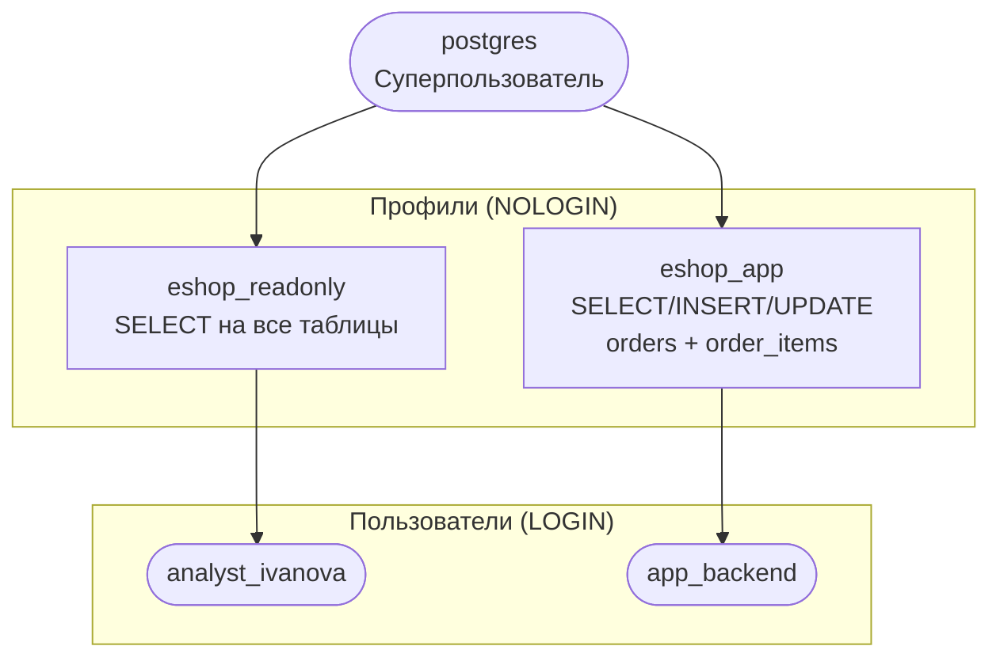

# Лабораторная работа №2
## Роли, привилегии, схемы. Создание сквозного проекта eshop

**Неделя:** 3–4  
**Ориентировочное время:** 2 занятия (≈ 4 ак. ч.)

---

## Цель работы

- Создать рабочую базу данных `eshop` — сквозной проект, который будет развиваться во всех последующих лабораторных работах.
- Настроить ролевую модель: разделить права приложения, аналитика и DBA.
- Применить Row-Level Security (RLS) на практике.

---

## Предварительные требования

- Завершена лаб. 01: PostgreSQL установлен, DBeaver работает.
- Прочитаны лек. 03 и лек. 04.

---

## Часть 1. Схема базы данных eshop

### 1.1. Создание базы и схемы

Подключитесь к серверу под суперпользователем `postgres` и выполните:

```sql
CREATE DATABASE eshop;
\c eshop
```

В DBeaver: создайте соединение с базой `eshop` (правый клик → New Database Connection).

### 1.2. Создание таблиц

Выполните скрипт в `eshop`:

```sql
-- Покупатели
-- region: в идеале — FK на справочник regions. Для учебного проекта храним текстовый код
-- ('MSK', 'SPB' и т.п.) — это упрощение, которое нарушает 3НФ, но снижает сложность схемы.
-- В production замените на: region_id BIGINT NOT NULL REFERENCES regions(id).
CREATE TABLE customers (
    id         BIGSERIAL PRIMARY KEY,
    name       TEXT NOT NULL,
    email      TEXT NOT NULL UNIQUE,
    phone      TEXT,
    region     TEXT NOT NULL,
    created_at TIMESTAMPTZ DEFAULT now()
);

-- Товары
CREATE TABLE products (
    id          BIGSERIAL PRIMARY KEY,
    name        TEXT NOT NULL,
    description TEXT,
    price       NUMERIC(10,2) NOT NULL CHECK (price > 0),
    stock_qty   INTEGER NOT NULL DEFAULT 0 CHECK (stock_qty >= 0),
    created_at  TIMESTAMPTZ DEFAULT now()
);

-- Заказы
-- total_amount — намеренная денормализация: поле можно вычислить из order_items,
-- но хранится отдельно для быстрого чтения без JOIN (кэшированное значение).
-- Ценой — необходимость синхронизировать значение при каждом изменении позиций.
CREATE TABLE orders (
    id           BIGSERIAL PRIMARY KEY,
    customer_id  BIGINT NOT NULL REFERENCES customers(id),
    status       TEXT NOT NULL DEFAULT 'pending'
                 CHECK (status IN ('pending','processing','shipped','delivered','cancelled')),
    total_amount NUMERIC(12,2) NOT NULL DEFAULT 0,
    created_at   TIMESTAMPTZ DEFAULT now()
);

-- Позиции заказа
CREATE TABLE order_items (
    id         BIGSERIAL PRIMARY KEY,
    order_id   BIGINT NOT NULL REFERENCES orders(id) ON DELETE CASCADE,
    product_id BIGINT NOT NULL REFERENCES products(id),
    quantity   INTEGER NOT NULL CHECK (quantity > 0),
    unit_price NUMERIC(10,2) NOT NULL CHECK (unit_price > 0)
);
```

### 1.3. Проверка структуры в DBeaver

Обновите дерево (**F5**) → раскройте `eshop → Schemas → public → Tables`. Убедитесь, что все 4 таблицы созданы. Нажмите правый клик → **ER Diagram** — вы увидите автосгенерированную ERD.

### 1.4. Наполнение тестовыми данными

```sql
INSERT INTO customers (name, email, phone, region) VALUES
    ('Анна Петрова',   'anna@example.com',  '+7-900-111-22-33', 'MSK'),
    ('Игорь Сидоров',  'igor@example.com',  '+7-900-222-33-44', 'SPB'),
    ('Мария Козлова',  'maria@example.com', '+7-900-333-44-55', 'MSK');

INSERT INTO products (name, price, stock_qty) VALUES
    ('Ноутбук',   89999.00, 15),
    ('Мышь',       1299.00, 200),
    ('Клавиатура', 3499.00, 100);

INSERT INTO orders (customer_id, status, total_amount) VALUES
    (1, 'delivered', 91298.00),
    (2, 'pending',    1299.00),
    (3, 'processing', 3499.00);

INSERT INTO order_items (order_id, product_id, quantity, unit_price) VALUES
    (1, 1, 1, 89999.00),
    (1, 2, 1,  1299.00),
    (2, 2, 1,  1299.00),
    (3, 3, 1,  3499.00);
```

---

## Часть 2. Ролевая модель

### 2.1. Создание ролей

```sql
-- Профиль «только чтение» — шаблон для аналитиков
CREATE ROLE eshop_readonly NOLOGIN;
GRANT CONNECT ON DATABASE eshop TO eshop_readonly;
GRANT USAGE  ON SCHEMA public TO eshop_readonly;
GRANT SELECT ON ALL TABLES IN SCHEMA public TO eshop_readonly;
ALTER DEFAULT PRIVILEGES IN SCHEMA public
    GRANT SELECT ON TABLES TO eshop_readonly;

-- Профиль «приложение» — для backend-сервиса
CREATE ROLE eshop_app NOLOGIN;
GRANT CONNECT ON DATABASE eshop TO eshop_app;
GRANT USAGE  ON SCHEMA public TO eshop_app;
GRANT SELECT, INSERT, UPDATE ON TABLE orders, order_items TO eshop_app;
GRANT SELECT ON TABLE customers, products TO eshop_app;
GRANT USAGE ON ALL SEQUENCES IN SCHEMA public TO eshop_app;

-- Конкретные пользователи
CREATE ROLE analyst_ivanova LOGIN PASSWORD 'analyst_pass_2024';
GRANT eshop_readonly TO analyst_ivanova;

CREATE ROLE app_backend LOGIN PASSWORD 'backend_pass_2024';
GRANT eshop_app TO app_backend;
```

### 2.2. Проверка прав

```sql
-- Переключиться на роль аналитика и проверить
SET ROLE analyst_ivanova;
SELECT COUNT(*) FROM customers;              -- должно работать
INSERT INTO customers (name, email, region)
    VALUES ('Тест', 'test@test.com', 'MSK'); -- должно выдать ошибку
RESET ROLE;

-- Проверить текущего пользователя
SELECT current_user, session_user;
```

### 2.3. Ролевая иерархия eshop



### 2.4. Просмотр привилегий

```sql
-- Кто имеет права на таблицу orders
SELECT grantee, privilege_type, is_grantable
FROM   information_schema.table_privileges
WHERE  table_name = 'orders'
ORDER  BY grantee;
```

---

## Часть 3. Row-Level Security (RLS)

Задача: аналитики из Москвы видят только заказы клиентов из региона `MSK`.

### 3.1. Включить RLS на таблице customers

```sql
ALTER TABLE customers ENABLE ROW LEVEL SECURITY;

-- Политика: каждый аналитик видит клиентов своего региона
-- (для демонстрации используем параметр current_setting)
CREATE POLICY customers_by_region ON customers
    FOR SELECT
    TO eshop_readonly
    USING (region = current_setting('app.current_region', true));
```

### 3.2. Проверка RLS

```sql
-- Установить параметр сеанса и проверить
SET ROLE analyst_ivanova;
SET app.current_region = 'MSK';
SELECT * FROM customers;    -- только MSK: Анна и Мария

SET app.current_region = 'SPB';
SELECT * FROM customers;    -- только SPB: Игорь

RESET ROLE;
```

### 3.3. Отключить RLS (для следующих работ)

RLS оставляем включённым, но для работ 03–08 будем подключаться под `postgres`, который обходит все RLS-политики как суперпользователь.

```sql
-- Проверить: суперпользователь видит всё
SELECT * FROM customers;    -- все 3 записи (под postgres)
```

---

## Часть 4. ALTER DEFAULT PRIVILEGES

В части 2.1 мы уже выполнили:
```sql
ALTER DEFAULT PRIVILEGES IN SCHEMA public
    GRANT SELECT ON TABLES TO eshop_readonly;
```

Это означает: **все таблицы, которые `postgres` создаст в `public` в будущем**, автоматически получат `SELECT` для `eshop_readonly`.

### 4.1. Проверить — новая таблица получает права автоматически

```sql
-- Создать таблицу ПОСЛЕ ALTER DEFAULT PRIVILEGES из части 2.1
CREATE TABLE audit_log (
    id         BIGSERIAL PRIMARY KEY,
    action     TEXT,
    created_at TIMESTAMPTZ DEFAULT now()
);

-- Проверить под аналитиком: права должны быть
SET ROLE analyst_ivanova;
SELECT * FROM audit_log;    -- работает: ALTER DEFAULT PRIVILEGES сработал
RESET ROLE;
```

### 4.2. В чём подвох — роль создана без ALTER DEFAULT PRIVILEGES

Создадим новую роль, которой выдали только явный `GRANT` на существующие таблицы:

```sql
CREATE ROLE eshop_report NOLOGIN;
GRANT CONNECT ON DATABASE eshop TO eshop_report;
GRANT USAGE   ON SCHEMA public  TO eshop_report;
GRANT SELECT  ON ALL TABLES IN SCHEMA public TO eshop_report;
-- ^ GRANT ON ALL TABLES выдаёт права только на таблицы, существующие СЕЙЧАС.
-- ALTER DEFAULT PRIVILEGES для eshop_report НЕ выдан.

CREATE ROLE analyst_petrov LOGIN PASSWORD 'petrov_pass_2024';
GRANT eshop_report TO analyst_petrov;

-- Создать новую таблицу
CREATE TABLE price_history (
    id         BIGSERIAL PRIMARY KEY,
    product_id BIGINT,
    old_price  NUMERIC(10,2),
    changed_at TIMESTAMPTZ DEFAULT now()
);

-- Проверить: eshop_report не получил права на price_history
SET ROLE analyst_petrov;
SELECT * FROM price_history;   -- ОШИБКА: permission denied
RESET ROLE;

-- Вариант 1: выдать права явно на уже существующую таблицу
GRANT SELECT ON price_history TO eshop_report;

-- Вариант 2: выдать ALTER DEFAULT PRIVILEGES для будущих таблиц
ALTER DEFAULT PRIVILEGES IN SCHEMA public
    GRANT SELECT ON TABLES TO eshop_report;
```

> **Правило:** `GRANT ON ALL TABLES` — для таблиц, которые уже есть.  
> `ALTER DEFAULT PRIVILEGES` — для таблиц, которые появятся в будущем.  
> Для полного покрытия нужны **оба** в правильном порядке: сначала `ALTER DEFAULT PRIVILEGES`, потом `GRANT ON ALL TABLES`.

---

## Чек-лист «работа зачтена»

- [ ] База `eshop` создана, 4 таблицы с данными.
- [ ] Роли `eshop_readonly`, `eshop_app`, `analyst_ivanova`, `app_backend` созданы.
- [ ] `analyst_ivanova` может выполнять SELECT, но не INSERT на `customers`.
- [ ] RLS включён: `analyst_ivanova` с `app.current_region='MSK'` видит 2 клиента из 3.
- [ ] ERD схемы сгенерирована в DBeaver.

---

## Самостоятельное задание

1. Создайте роль `eshop_manager` с правами SELECT, INSERT, UPDATE на все таблицы.
2. Добавьте политику RLS: `app_backend` видит только заказы со статусом `'pending'` и `'processing'`.
3. Зарисуйте ролевую иерархию `eshop` в виде ERD/Mermaid-диаграммы (используйте flowchart).

---

## Ссылки

- CREATE ROLE: https://www.postgresql.org/docs/current/sql-createrole.html
- GRANT: https://www.postgresql.org/docs/current/sql-grant.html
- Row Security Policies: https://www.postgresql.org/docs/current/ddl-rowsecurity.html
- ALTER DEFAULT PRIVILEGES: https://www.postgresql.org/docs/current/sql-alterdefaultprivileges.html
