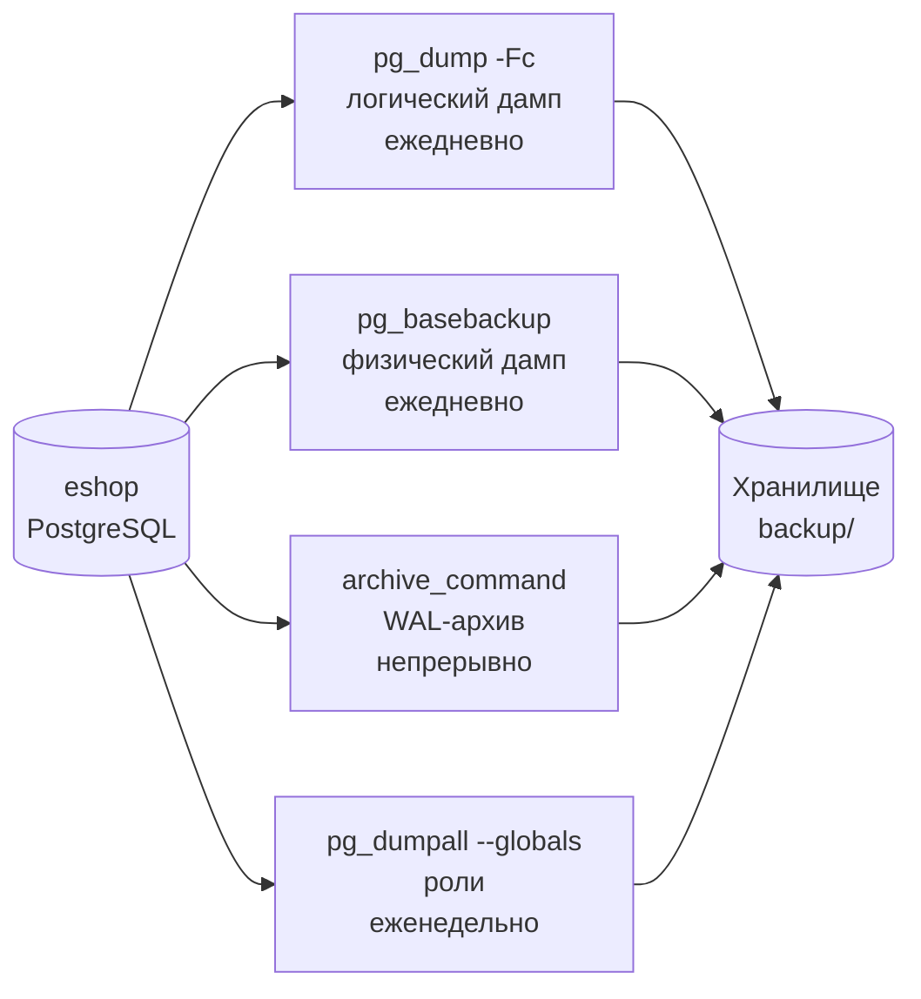

# Лабораторная работа №3
## Резервное копирование базы данных eshop

**Неделя:** 5  
**Ориентировочное время:** 2 занятия (≈ 4 ак. ч.)

---

## Цель работы

- Выполнить логическое резервное копирование базы `eshop` несколькими способами.
- Освоить pg_dump (plain, custom, directory), pg_dumpall.
- Настроить WAL-архивирование.
- Выработать личный регламент резервного копирования.

---

## Предварительные требования

- Завершена лаб. 02: база `eshop` создана с 4 таблицами и тестовыми данными.
- Прочитана лек. 05.
- Создана папка `C:\backup\eshop\` (Windows) или `~/backup/eshop/` (Linux).

---

## Схема стратегии резервного копирования



---

## Часть 1. Логический дамп: pg_dump

### 1.1. Plain-формат (читаемый SQL)

```bash
# Windows (из командной строки)
pg_dump -h localhost -U postgres -Fp eshop -f C:\backup\eshop\eshop_plain.sql

# Linux
pg_dump -h localhost -U postgres -Fp eshop -f ~/backup/eshop/eshop_plain.sql
```

Откройте файл в VS Code. Найдите:
- `CREATE TABLE customers` — схема
- `COPY customers` — данные (в plain SQL используется COPY, это быстрее INSERT)

### 1.2. Custom-формат (рекомендуемый)

```bash
pg_dump -h localhost -U postgres -Fc eshop \
    -f C:\backup\eshop\eshop_$(date +%Y%m%d).dump
```

Просмотрите содержимое без восстановления:
```bash
pg_restore --list C:\backup\eshop\eshop_20240901.dump
```

### 1.3. Дамп только схемы / только данных

```bash
# Только схема (без данных) — для документирования структуры
pg_dump -h localhost -U postgres --schema-only eshop -f C:\backup\eshop\eshop_schema.sql

# Только данные
pg_dump -h localhost -U postgres --data-only eshop -f C:\backup\eshop\eshop_data.sql

# Только одна таблица
pg_dump -h localhost -U postgres -t orders eshop -f C:\backup\eshop\orders_only.sql
```

### 1.4. Directory-формат с параллелизмом

```bash
pg_dump -h localhost -U postgres -Fd -j 4 eshop \
    -f C:\backup\eshop\eshop_dir\
```

Откройте папку — увидите отдельные файлы на каждую таблицу.

---

## Часть 2. Дамп глобальных объектов: pg_dumpall

```bash
# Дамп ролей (не включается в pg_dump)
pg_dumpall -h localhost -U postgres --globals-only \
    -f C:\backup\eshop\globals.sql
```

Откройте `globals.sql` в VS Code. Найдите:
- `CREATE ROLE analyst_ivanova` — роль создана в лаб. 02
- `CREATE ROLE app_backend`
- Зашифрованный хэш пароля

> **Почему это важно:** при переносе на новый сервер сначала восстанавливаете `globals.sql` (роли), затем базу. Без этого `pg_restore` выдаст ошибку «role does not exist».

---

## Часть 3. Физическое резервное копирование: pg_basebackup

> На учебном стенде используется один сервер, поэтому `pg_basebackup` запускается локально.

### 3.1. Подготовить роль для репликации

```sql
-- Выполнить в psql под postgres
CREATE ROLE repl_user REPLICATION LOGIN PASSWORD 'repl_pass_2024';
```

```
-- Добавить в pg_hba.conf (файл в PGDATA):
host    replication    repl_user    127.0.0.1/32    scram-sha-256
```

Перечитать pg_hba.conf без перезапуска:
```sql
SELECT pg_reload_conf();
```

### 3.2. Снять физическую копию

```bash
pg_basebackup -h localhost -U repl_user \
    -D C:\backup\eshop\basebackup\ \
    -Fp -Xs -P
```

Дождитесь завершения (прогресс-бар покажет % от объёма кластера).

### 3.3. Что внутри basebackup

Откройте папку `basebackup/`. Вы увидите:
- `base/` — файлы таблиц
- `pg_wal/` — WAL-файлы, нужные для консистентного восстановления
- `postgresql.conf` — конфигурация

---

## Часть 4. WAL-архивирование

### 4.1. Настройка

Создайте папку для архива: `C:\backup\eshop\wal_archive\`

В `postgresql.conf` добавьте (или раскомментируйте):
```ini
wal_level        = replica
archive_mode     = on
archive_command  = 'copy "%p" "C:\\backup\\eshop\\wal_archive\\%f"'
archive_timeout  = 60
```

> На Linux: `archive_command = 'cp %p ~/backup/eshop/wal_archive/%f'`

Перезапустите PostgreSQL.

### 4.2. Проверка

```sql
-- Принудительно переключить WAL-файл
SELECT pg_switch_wal();

-- Проверить статус архивирования
SELECT last_archived_wal, last_archived_time, failed_count
FROM   pg_stat_archiver;
```

Откройте папку `wal_archive/` — должен появиться файл с именем вида `00000001000000000000001`.

---

## Часть 5. Стратегия резервного копирования

Заполните таблицу регламента для `eshop`:

| Уровень         | Команда              | Частота     | Хранить  | Папка / цель           |
|-----------------|----------------------|-------------|----------|------------------------|
| Физический      | pg_basebackup        | Ежедневно   | 7 дней   | `backup/basebackup/`   |
| Логический      | pg_dump -Fc          | Ежедневно   | 14 дней  | `backup/eshop/`        |
| WAL-архив       | archive_command      | Непрерывно  | 7 дней   | `backup/wal_archive/`  |
| Глобальные роли | pg_dumpall --globals | Еженедельно | 4 недели | `backup/globals/`      |

Сохраните этот файл как `C:\backup\eshop\backup_policy.md`.

---

## Чек-лист «работа зачтена»

- [ ] `eshop_plain.sql` — plain-дамп создан, файл открывается в VS Code.
- [ ] `eshop_YYYYMMDD.dump` — custom-дамп создан; `pg_restore --list` выводит объекты.
- [ ] `globals.sql` — содержит роли `analyst_ivanova` и `app_backend`.
- [ ] `basebackup/` — папка создана, содержит подкаталог `base/` и файлы WAL.
- [ ] `pg_stat_archiver.failed_count = 0` — архивирование работает.
- [ ] `backup_policy.md` — регламент заполнен.

---

## Самостоятельное задание

1. Разберите готовый шаблон скрипта резервного копирования, объясните каждую строку и запустите:

```bash
#!/bin/bash
# backup_eshop.sh — ежедневный бэкап базы eshop
BACKUP_DIR="$HOME/backup/eshop"
DATE=$(date +%Y%m%d_%H%M)
DB="eshop"
RETAIN_DAYS=14

pg_dump -h localhost -U postgres -Fc "$DB" \
    -f "$BACKUP_DIR/eshop_${DATE}.dump"

find "$BACKUP_DIR" -name "*.dump" -mtime +$RETAIN_DAYS -delete

echo "Готово: $BACKUP_DIR/eshop_${DATE}.dump"
```

   Вопросы для разбора:
   - Что делает `date +%Y%m%d_%H%M`?
   - Что делает `-mtime +14` у команды `find`?
   - Как изменить скрипт, чтобы хранить дампы 30 дней?

   Для Windows PowerShell — замените `find ... -mtime` на эквивалент:
   ```powershell
   Get-ChildItem "$BackupDir\*.dump" |
       Where-Object { $_.LastWriteTime -lt (Get-Date).AddDays(-14) } |
       Remove-Item
   ```

2. Как проверить, что дамп корректен? Опишите процедуру (не выполняя — только опишите шаги).

---

## Ссылки

- pg_dump: https://www.postgresql.org/docs/current/app-pgdump.html
- pg_basebackup: https://www.postgresql.org/docs/current/app-pgbasebackup.html
- WAL-архивирование: https://www.postgresql.org/docs/current/continuous-archiving.html
- Правило 3-2-1: https://www.postgresql.org/docs/current/backup.html
