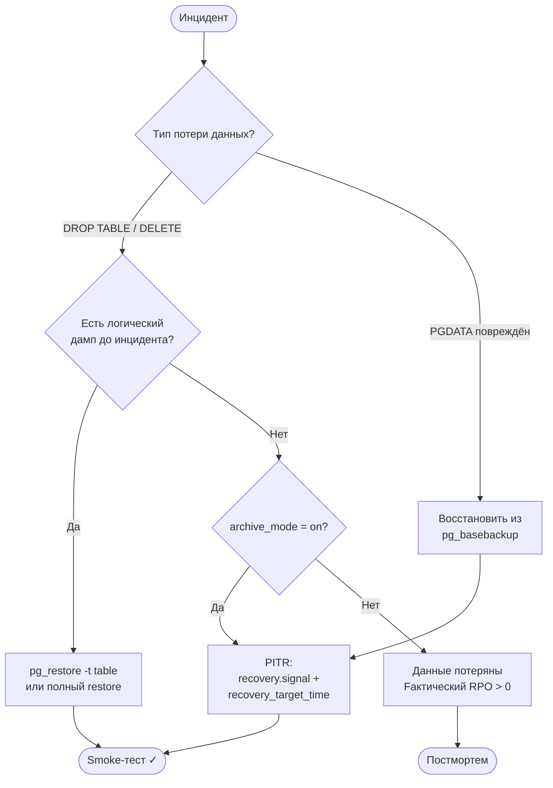

# Лабораторная работа №4
## Восстановление базы eshop. PITR. Failover Runbook

**Неделя:** 6  
**Ориентировочное время:** 2 занятия (≈ 4 ак. ч.)

---

## Цель работы

- Выполнить выборочное и полное восстановление базы из логического дампа.
- Симулировать PITR: восстановление на момент до «случайного» DROP TABLE.
- Составить Failover Runbook для базы `eshop`.

---

## Предварительные требования

- Завершена лаб. 03: дампы и WAL-архив настроены.
- Прочитана лек. 06.

---

## Часть 1. Восстановление из логического дампа

### 1.1. Симулировать катастрофу

```sql
-- Подключиться к eshop под postgres
\c eshop

-- «Случайно» удалить таблицу
DROP TABLE order_items;

-- Проверить
\dt
-- order_items — исчезла
```

### 1.2. Выборочное восстановление одной таблицы

```bash
# Восстановить только order_items из custom-дампа
pg_restore -h localhost -U postgres \
    -d eshop \
    -t order_items \
    C:\backup\eshop\eshop_20240901.dump
```

```sql
-- Проверить
SELECT COUNT(*) FROM order_items;    -- должно вернуть 4
```

### 1.3. Полное восстановление в новую базу

```bash
# Создать тестовую базу-приёмник
createdb -h localhost -U postgres eshop_restore_test

# Восстановить полностью
pg_restore -h localhost -U postgres \
    -d eshop_restore_test \
    -Fc C:\backup\eshop\eshop_20240901.dump \
    --verbose
```

```sql
-- Подключиться к eshop_restore_test и проверить
\c eshop_restore_test
SELECT COUNT(*) FROM customers;     -- 3
SELECT COUNT(*) FROM orders;        -- 3
SELECT COUNT(*) FROM order_items;   -- 4
```

### 1.4. Типичные ошибки и решения

```bash
# Ошибка: "role does not exist"
# Решение: сначала восстановить глобальные объекты
psql -h localhost -U postgres -f C:\backup\eshop\globals.sql

# Ошибка: "database already exists"
# Решение: использовать флаг --clean или пересоздать базу
dropdb -h localhost -U postgres eshop_restore_test
createdb -h localhost -U postgres eshop_restore_test
pg_restore ... eshop_20240901.dump
```

---

## Часть 2. Дерево решений для восстановления



---

## Часть 2. Симуляция PITR

> Полный PITR с физическим перемещением PGDATA требует прав на уровне ОС и перезапуска PostgreSQL. На учебном стенде выполняем упрощённую симуляцию через логический дамп с меткой времени.

### 2.1. Зафиксировать «точку до катастрофы»

```sql
\c eshop
-- Запомнить текущее время
SELECT now() AS safe_point;
-- Например: 2024-09-01 15:30:00+03
```

### 2.2. Выполнить «деструктивную миграцию»

```sql
-- Симулировать плохую миграцию
DELETE FROM order_items;
DELETE FROM orders;
-- Зафиксировать время после катастрофы
SELECT now() AS disaster_time;
```

### 2.3. Восстановление на safe_point

```sql
-- Вариант 1: восстановить из дампа (если дамп был до DELETE)
-- В данном случае используем дамп из лаб. 03
\c postgres
DROP DATABASE eshop_restore_test;
CREATE DATABASE eshop_restore_test;
```

```bash
pg_restore -h localhost -U postgres \
    -d eshop_restore_test \
    -Fc C:\backup\eshop\eshop_20240901.dump
```

```sql
\c eshop_restore_test
SELECT COUNT(*) FROM orders;        -- 3 — данные до катастрофы восстановлены
```

### 2.4. Процедура настоящего PITR (описательно)

Для реального PITR (когда настроен `archive_mode=on`):

```markdown
1. Остановить PostgreSQL
2. Заменить PGDATA содержимым pg_basebackup
3. Создать файл recovery.signal в PGDATA
4. Добавить в postgresql.conf:
   restore_command        = 'copy "C:\\backup\\eshop\\wal_archive\\%f" "%p"'
   recovery_target_time   = '2024-09-01 15:30:00'
   recovery_target_action = 'promote'
5. Запустить PostgreSQL — он войдёт в режим recovery
6. После завершения: SELECT pg_last_xact_replay_timestamp();
```

Убедитесь, что `archive_mode` был включён на шаге до катастрофы.

---

## Часть 3. Failover Runbook: роль аналитика

DBA пишет и исполняет технические шаги runbook. Задача аналитика — **проверить, что runbook полный**, заполнить контактный блок и понимать, какие шаги требуют его участия (смоук-тест приложения, коммуникация с бизнесом).

### 3.1. Изучить готовый шаблон runbook

Создайте файл `C:\backup\eshop\failover_runbook.md` с содержимым:

```markdown
## Failover Runbook: eshop production

### Контакты
| Роль              | Имя | Телефон/Telegram |
|-------------------|-----|------------------|
| DBA on-call       |     |                  |
| Разработчик       |     |                  |
| Аналитик (вы)     |     |                  |
| Руководитель      |     |                  |

> Заполните таблицу — в реальном инциденте на поиск контакта нет времени.

### Признаки отказа (кто что замечает)

| Признак                                          | Кто первый видит     |
|--------------------------------------------------|----------------------|
| Приложение выдаёт "connection refused" или "FATAL" | Мониторинг / DevOps |
| Пользователи жалуются: «не могу войти»           | Аналитик             |
| PostgreSQL не отвечает на порту 5432             | DBA                  |
| Отчёт пустой или данные устарели                 | Аналитик             |

### Сценарий A: Повреждение данных (DROP TABLE / плохой UPDATE)

#### Шаги DBA (информационно — понять, что делает DBA):
1. Зафиксировать точное время инцидента.
2. Проверить: есть ли pg_dump до инцидента? → да → `pg_restore -t <table>`
3. Если дампа нет, есть WAL-архив → PITR: `recovery_target_time = '<время>'`
4. После восстановления: `SELECT COUNT(*) FROM orders;` — проверить количество строк.
5. `flyway info` — убедиться, что статус миграций корректен.

#### Шаги аналитика (выполняете вы):
- [ ] Сообщить пользователям: «Ведутся технические работы, ориентировочное время — [N] минут».
- [ ] После восстановления: запустить smoke-тест — войти в приложение, создать тестовый заказ, проверить отчёт.
- [ ] Зафиксировать фактические потери данных (сколько транзакций утеряно).

### Сценарий B: Отказ сервера

#### Шаги DBA (информационно):
1. Попытаться перезапустить: `pg_ctl start`; проверить логи.
2. Если PGDATA недоступен → восстановить из `pg_basebackup`.
3. Применить WAL-архив → `recovery_target_time = <время>` → запустить PG.
4. Проверить: `SELECT pg_last_xact_replay_timestamp();`

#### Шаги аналитика (выполняете вы):
- [ ] Коммуникация с бизнесом: эскалация, обновление статуса каждые 15 минут.
- [ ] Подготовить список затронутых операций для постмортема.
- [ ] Smoke-тест после восстановления.

### После восстановления
- Зафиксировать: время начала, время конца, фактическое RPO (потери данных).
- Постмортем в течение 24 часов.
- Обновить контакты и признаки отказа в этом runbook.
```

### 3.2. Контрольные вопросы к runbook

Разберите эти вопросы письменно в конце runbook (раздел «Вопросы аналитика к DBA»):

1. Как я узнаю, что восстановление завершено и данные целостны?
2. На каком этапе я могу сообщить пользователям, что система работает?
3. Какие данные могут быть потеряны при PITR? Как об этом сообщить бизнесу?
4. Как часто проводится тестовое восстановление из бэкапа (backup drill)? Кто участвует?

---

## Часть 4. Проверка стратегии восстановления

Ответьте на вопросы (письменно, в конце runbook):

| Сценарий                               | Ваш метод восстановления | Ожидаемое RTO |
|----------------------------------------|--------------------------|---------------|
| Удалена одна таблица (`DROP TABLE`)    | ?                        | ?             |
| Удалены все строки (`DELETE FROM ...`) | ?                        | ?             |
| Отказ диска (PGDATA недоступен)        | ?                        | ?             |
| Плохая миграция 2 часа назад           | ?                        | ?             |

---

## Чек-лист «работа зачтена»

- [ ] `order_items` восстановлена выборочно из дампа: COUNT(*) = 4.
- [ ] `eshop_restore_test` создана, полное восстановление выполнено, данные совпадают.
- [ ] `failover_runbook.md` создан: контактная таблица заполнена, разделы «шаги аналитика» содержат чек-листы.
- [ ] Контрольные вопросы (3.2) разобраны письменно в разделе «Вопросы аналитика к DBA».
- [ ] Таблица сценариев (часть 4) заполнена.

---

## Самостоятельное задание

1. Добавьте в `eshop` 100 случайных заказов:
   ```sql
   INSERT INTO orders (customer_id, status, total_amount)
   SELECT (random()*2+1)::int, 'pending', random()*5000
   FROM   generate_series(1, 100);
   ```
2. Создайте новый дамп.
3. «Случайно» удалите все заказы со статусом `pending`.
4. Восстановите только эти заказы из дампа (подсказка: `pg_restore --data-only -t orders`).

---

## Ссылки

- pg_restore: https://www.postgresql.org/docs/current/app-pgrestore.html
- PITR: https://www.postgresql.org/docs/current/continuous-archiving.html#BACKUP-PITR-RECOVERY
- recovery.signal: https://www.postgresql.org/docs/current/recovery-config.html
