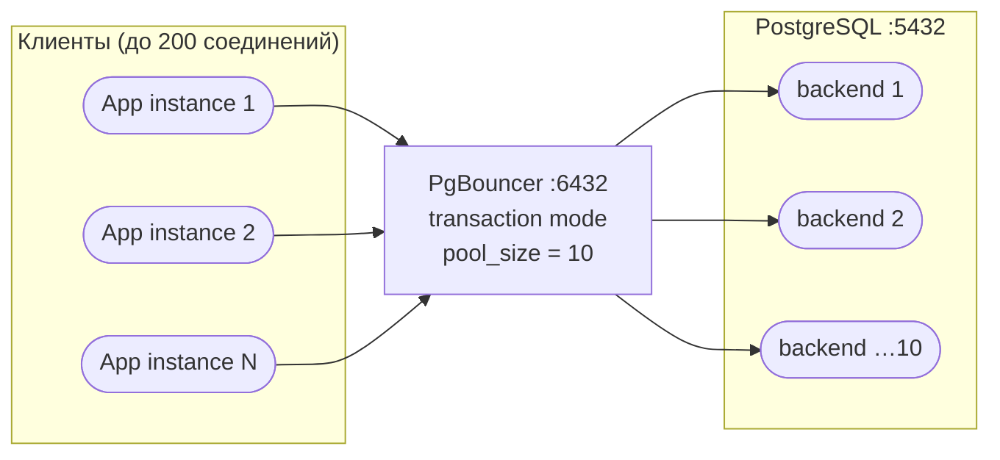

# Лабораторная работа №7
## Индексы, autovacuum, PgBouncer для eshop

**Неделя:** 9  
**Ориентировочное время:** 2 занятия (≈ 4 ак. ч.)

---

## Цель работы

- Создавать частичные, составные и функциональные индексы под конкретные запросы.
- Контролировать autovacuum и настраивать его для активных таблиц.
- Установить и настроить PgBouncer, переключить приложение на пул соединений.

---

## Предварительные требования

- Завершена лаб. 06: индексы созданы, `pg_stat_statements` подключён.
- Прочитана лек. 09.
- В базе `eshop` есть минимум 1000 заказов (при необходимости добавить):
  ```sql
  INSERT INTO orders (customer_id, status, total_amount)
  SELECT (random()*2+1)::int,
         (ARRAY['pending','processing','shipped','delivered','cancelled'])[ceil(random()*5)::int],
         (random()*20000)::numeric(12,2)
  FROM   generate_series(1, 1000);
  ```

---

## Часть 1. Индексы

### 1.1. Найти медленные запросы, требующие индексов

```sql
-- Запросы, которые делают Seq Scan на orders по status
EXPLAIN (ANALYZE, BUFFERS)
SELECT * FROM orders WHERE status = 'pending';
```

Запишите: тип узла = ___, actual time = ___ ms.

### 1.2. Обычный B-tree индекс

```sql
CREATE INDEX idx_orders_status ON orders(status);

EXPLAIN (ANALYZE, BUFFERS)
SELECT * FROM orders WHERE status = 'pending';
```

Тип узла теперь: ___, actual time = ___ ms. Ускорение: × ___

### 1.3. Частичный индекс

Активные заказы (`pending`, `processing`) — самая частая выборка. Частичный индекс меньше и быстрее:

```sql
DROP INDEX idx_orders_status;

CREATE INDEX idx_orders_active ON orders(status)
    WHERE status IN ('pending', 'processing');

EXPLAIN (ANALYZE, BUFFERS)
SELECT * FROM orders WHERE status = 'pending';
-- Планировщик использует частичный индекс для 'pending'

EXPLAIN (ANALYZE, BUFFERS)
SELECT * FROM orders WHERE status = 'delivered';
-- Для 'delivered' — Seq Scan (не входит в частичный индекс) — это ожидаемо
```

### 1.4. Составной индекс

```sql
-- Запрос, который ищет по region + status
EXPLAIN (ANALYZE, BUFFERS)
SELECT o.* FROM orders o
JOIN customers c ON c.id = o.customer_id
WHERE c.region = 'MSK' AND o.status = 'pending';

-- Создать составной индекс (порядок: сначала равенство, потом диапазон)
CREATE INDEX idx_customers_region_email ON customers(region, email);

-- Повторить EXPLAIN ANALYZE
EXPLAIN (ANALYZE, BUFFERS)
SELECT o.* FROM orders o
JOIN customers c ON c.id = o.customer_id
WHERE c.region = 'MSK' AND o.status = 'pending';
```

### 1.5. CREATE INDEX CONCURRENTLY (безопасное создание в production)

```sql
-- Обычный CREATE INDEX блокирует таблицу на запись
-- В production используют CONCURRENTLY

CREATE INDEX CONCURRENTLY idx_orders_created_at_status
    ON orders(created_at DESC, status);

-- Проверить, что индекс создался корректно (не INVALID)
SELECT indexname, indisvalid
FROM   pg_indexes
JOIN   pg_class ON relname = tablename
JOIN   pg_index ON indexrelid = pg_class.oid
WHERE  tablename = 'orders';

-- Если indisvalid = false — индекс нужно удалить и пересоздать
```

### 1.6. Функциональный индекс

Обычный B-tree индекс `ON customers(email)` не помогает запросу `WHERE LOWER(email) = ...` — планировщик не может использовать индекс по `email` для поиска по `LOWER(email)`. Нужен индекс по **выражению**:

```sql
-- Функциональный индекс — индексирует результат функции, а не значение колонки
CREATE INDEX idx_customers_email_lower ON customers(LOWER(email));

-- Теперь этот запрос использует индекс:
EXPLAIN (ANALYZE, BUFFERS)
SELECT * FROM customers WHERE LOWER(email) = 'anna@example.com';

-- А этот — нет (значение не приведено к нижнему регистру):
EXPLAIN (ANALYZE, BUFFERS)
SELECT * FROM customers WHERE email = 'anna@example.com';
```

Запишите: какой тип узла у первого запроса? У второго? Чем объясняется разница?

> **Когда применять:** всегда, когда WHERE-условие содержит вызов функции над колонкой: `LOWER`, `DATE_TRUNC`, `EXTRACT`, `jsonb->>'key'` и т.п.

### 1.7. Неиспользуемые индексы

```sql
-- Найти индексы, которые ни разу не использовались
SELECT schemaname, relname AS table_name, indexrelname AS index_name, idx_scan
FROM   pg_stat_user_indexes
WHERE  idx_scan = 0
  AND  indexrelname NOT LIKE '%pkey'   -- PK исключить
ORDER  BY relname;
```

Запишите найденные неиспользуемые индексы: ___

> **Осторожно:** перед удалением проверьте, не появится ли индекс в статистике после новых запросов. Сбросьте статистику и запустите нагрузку.

---

## Часть 2. Autovacuum

### 2.1. Проверить работу autovacuum на активной таблице

Создадим интенсивную нагрузку на `orders`:

```sql
DO $$
BEGIN
    FOR i IN 1..500 LOOP
        UPDATE orders SET status = 'processing' WHERE id = (random()*100+1)::int;
    END LOOP;
END;
$$;
```

```sql
-- Проверить bloat и autovacuum
SELECT relname, n_dead_tup, n_live_tup, last_autovacuum, last_autoanalyze
FROM   pg_stat_user_tables
WHERE  relname = 'orders';
```

Подождите 1–2 минуты. Повторите запрос — `n_dead_tup` должно упасть.

### 2.2. Тонкая настройка autovacuum для таблицы

Если таблица `orders` очень активная, порог autovacuum по умолчанию (`20%`) слишком высокий — мёртвые строки накапливаются. Снизить порог:

```sql
ALTER TABLE orders SET (
    autovacuum_vacuum_scale_factor   = 0.01,   -- 1% вместо 20%
    autovacuum_analyze_scale_factor  = 0.005
);
```

Проверить настройки:
```sql
SELECT relname, reloptions
FROM   pg_class
WHERE  relname = 'orders';
```

### 2.3. Ручной VACUUM ANALYZE

```sql
-- Принудительно — для одной таблицы
VACUUM ANALYZE orders;

-- Для всей базы — через утилиту (терминал):
-- vacuumdb -h localhost -U postgres -d eshop -z -v
```

---

## Часть 3. PgBouncer

### 3.1. Установка PgBouncer

```bash
# Linux
apt-get install pgbouncer

# Windows: скачать с https://www.pgbouncer.org/install.html
# или через winget: winget install pgbouncer
```

### 3.2. Настройка pgbouncer.ini

Создайте или отредактируйте `/etc/pgbouncer/pgbouncer.ini`:

```ini
[databases]
eshop = host=127.0.0.1 port=5432 dbname=eshop

[pgbouncer]
listen_addr         = 127.0.0.1
listen_port         = 6432
auth_type           = scram-sha-256
auth_file           = /etc/pgbouncer/userlist.txt

pool_mode           = transaction
max_client_conn     = 200
default_pool_size   = 10
min_pool_size       = 2
reserve_pool_size   = 5
reserve_pool_timeout= 5

log_connections     = 1
log_disconnections  = 1
logfile             = /var/log/pgbouncer/pgbouncer.log
pidfile             = /var/run/pgbouncer/pgbouncer.pid

# Административный интерфейс
admin_users         = pgbouncer_admin
```

### 3.3. Создать файл пользователей

```bash
# Получить хэш пароля из PostgreSQL
psql -h localhost -U postgres -c "SELECT usename, passwd FROM pg_shadow WHERE usename = 'app_backend';"
```

Скопируйте строку вида `"scram-sha-256$..."` в `/etc/pgbouncer/userlist.txt`:
```
"app_backend" "scram-sha-256$4096:..."
"pgbouncer_admin" "admin_pass"
```

### 3.4. Архитектура PgBouncer



### 3.5. Запустить и проверить

```bash
pgbouncer /etc/pgbouncer/pgbouncer.ini -d
```

```bash
# Подключиться через PgBouncer (порт 6432 вместо 5432)
psql -h 127.0.0.1 -p 6432 -U app_backend -d eshop -c "SELECT COUNT(*) FROM orders;"
```

```bash
# Административный интерфейс
psql -h 127.0.0.1 -p 6432 -U pgbouncer_admin -d pgbouncer
SHOW POOLS;
SHOW STATS;
SHOW CLIENTS;
```

### 3.6. Проверка ограничений transaction-режима

```sql
-- В transaction mode работает
BEGIN;
SELECT * FROM orders WHERE id = 1;
COMMIT;

-- НЕ работает в transaction mode (привязано к сессии):
PREPARE my_stmt AS SELECT * FROM orders WHERE id = $1;
-- Ошибка: prepared statements не поддерживаются в transaction mode

-- SET не сохраняется между запросами (каждый на другом backend-соединении)
SET work_mem = '64MB';   -- установится, но будет потеряно
```

---

## Часть 4. Обоснование в паспорте архитектурных изменений

Для любой производственной системы нужно обоснование. Составьте мини-документ (сохраните как `pgbouncer_justification.md`):

```markdown
## Обоснование введения PgBouncer для eshop

### Проблема
- При 50 одновременных пользователях приложение открывало 50 соединений к PostgreSQL.
- Каждое соединение потребляет ~5 МБ RAM (shared_buffers не в счёт).
- 50 × 5 МБ = 250 МБ только на backend-процессы.

### Решение
- PgBouncer transaction mode + default_pool_size = 10.
- 50 клиентов обслуживаются 10 реальными backend-соединениями.

### Эффект
- RAM: 10 × 5 МБ = 50 МБ (−80%).
- CPU: меньше контекстных переключений в pg.
- Задержка: +0.2 мс (overhead пула) — приемлемо.

### Ограничения
- Prepared statements требуют session mode или переработки ORM.
- SET параметры не сохраняются между запросами.
```

---

## Чек-лист «работа зачтена»

- [ ] Частичный индекс `idx_orders_active` создан; EXPLAIN ANALYZE показывает `Index Scan`.
- [ ] `autovacuum_vacuum_scale_factor = 0.01` выставлен на таблице `orders`.
- [ ] PgBouncer запущен на порту 6432; `SELECT COUNT(*)` через 6432 работает.
- [ ] `SHOW POOLS` показывает пул `eshop`; `cl_active > 0`.
- [ ] `pgbouncer_justification.md` создан.

---

## Самостоятельное задание

1. В п. 1.6 вы создали `idx_customers_email_lower`. Добавьте аналогичный функциональный индекс `ON products(LOWER(name))` и проверьте, что запрос `WHERE LOWER(name) = 'ноутбук'` использует его. Объясните, почему без индекса по выражению Seq Scan неизбежен.
2. Переключите PgBouncer в режим `session` (измените `pool_mode = session` в `pgbouncer.ini`, перезапустите) и проверьте, что `PREPARE` теперь работает.
3. Объясните разницу между session / transaction / statement режимами PgBouncer одной таблицей.

---

## Ссылки

- Индексы PostgreSQL: https://www.postgresql.org/docs/current/indexes.html
- CREATE INDEX CONCURRENTLY: https://www.postgresql.org/docs/current/sql-createindex.html
- autovacuum: https://www.postgresql.org/docs/current/routine-vacuuming.html
- PgBouncer: https://www.pgbouncer.org/config.html
