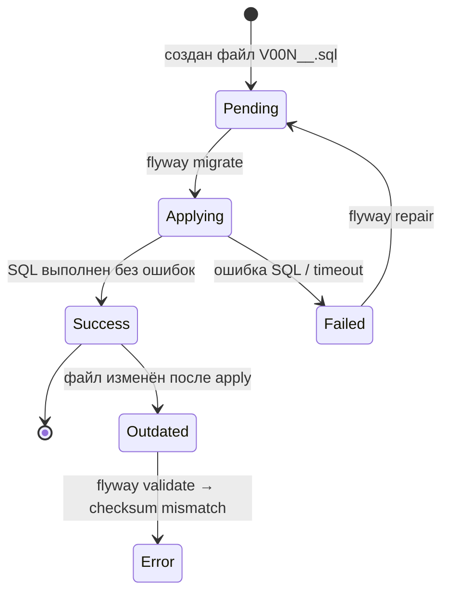

# Лабораторная работа №9
## Flyway: миграции схемы eshop. Migration Plan и Runbook

**Неделя:** 12  
**Ориентировочное время:** 2 занятия (≈ 4 ак. ч.)

---

## Цель работы

- Формализовать схему `eshop` через Flyway-миграции.
- Освоить цикл: plan → validate → migrate → info → repair.
- Написать Migration Plan и Runbook для производственного деплоя изменений схемы.

---

## Предварительные требования

- Завершена лаб. 02: база `eshop` с таблицами и ролями существует.
- Прочитана лек. 12.
- Установлен Flyway CLI (https://documentation.red-gate.com/fd/command-line-184127404.html).

---

## Жизненный цикл миграции Flyway



---

## Часть 1. Установка и настройка Flyway

### 1.1. Установка Flyway CLI

```bash
# Linux
wget -qO- https://download.red-gate.com/maven/release/com/redgate/flyway/flyway-commandline/10.21.0/flyway-commandline-10.21.0-linux-x64.tar.gz | tar xvz
sudo ln -s $(pwd)/flyway-10.21.0/flyway /usr/local/bin/flyway

# Windows: скачать ZIP с сайта, распаковать, добавить папку в PATH
```

Проверка:
```bash
flyway --version
```

### 1.2. Структура проекта

Создайте структуру папок:

```
eshop-migrations/
├── flyway.toml
└── migrations/
    ├── V001__create_schema.sql
    ├── V002__add_products_category.sql
    └── V003__create_promo_codes.sql
```

### 1.3. flyway.toml

```toml
[environments.default]
url      = "jdbc:postgresql://localhost:5432/eshop"
user     = "postgres"
password = "your_postgres_password"
locations = ["filesystem:./migrations"]

[flyway]
cleanDisabled    = true
validateOnMigrate = true
outOfOrder       = false
```

> `cleanDisabled = true` обязателен в production: защита от случайного `flyway clean`, который удалит все данные.

---

## Часть 2. Миграция V001: фиксируем существующую схему

Так как схема уже существует, используем `baseline` — говорим Flyway: «всё до этой версии уже есть».

### 2.1. Базирование

```bash
# Зафиксировать текущее состояние как версию 1
flyway -configFiles=flyway.toml baseline -baselineVersion=1 -baselineDescription="initial_eshop_schema"
```

```sql
-- Проверить в БД: таблица истории
SELECT * FROM flyway_schema_history ORDER BY installed_rank;
```

### 2.2. Первая настоящая миграция: добавить категорию товаров

Создайте `migrations/V002__add_products_category.sql`:

```sql
-- V002: добавить категории товаров

CREATE TABLE categories (
    id   SERIAL PRIMARY KEY,
    name TEXT NOT NULL UNIQUE
);

INSERT INTO categories (name) VALUES
    ('Электроника'),
    ('Периферия'),
    ('Аксессуары');

ALTER TABLE products ADD COLUMN category_id INTEGER REFERENCES categories(id);

UPDATE products SET category_id = 1 WHERE name = 'Ноутбук';
UPDATE products SET category_id = 2 WHERE name = 'Мышь';
UPDATE products SET category_id = 2 WHERE name = 'Клавиатура';

COMMENT ON TABLE categories IS 'Категории товаров';
```

```bash
# Проверить: Flyway увидит новую миграцию, но не выполнит её
flyway -configFiles=flyway.toml info

# Выполнить
flyway -configFiles=flyway.toml migrate

# Проверить статус
flyway -configFiles=flyway.toml info
```

```sql
-- Убедиться, что таблица создана и данные на месте
SELECT p.name, c.name AS category
FROM   products p
JOIN   categories c ON c.id = p.category_id;
```

### 2.3. Вторая миграция: промокоды

Создайте `migrations/V003__create_promo_codes.sql`:

```sql
-- V003: промокоды для заказов

CREATE TABLE promo_codes (
    id           SERIAL PRIMARY KEY,
    code         TEXT NOT NULL UNIQUE,
    discount_pct NUMERIC(5,2) NOT NULL CHECK (discount_pct BETWEEN 1 AND 99),
    valid_until  DATE,
    is_active    BOOLEAN NOT NULL DEFAULT TRUE
);

ALTER TABLE orders ADD COLUMN promo_code_id INTEGER REFERENCES promo_codes(id);

INSERT INTO promo_codes (code, discount_pct, valid_until) VALUES
    ('WELCOME10', 10.00, '2025-12-31'),
    ('SALE20',    20.00, '2024-10-01');
```

```bash
flyway -configFiles=flyway.toml migrate
flyway -configFiles=flyway.toml info
```

---

## Часть 3. Специальные ситуации

### 3.1. Repeatable migration (R__): пересоздание представления

Repeatable-миграции запускаются каждый раз, когда меняется их контрольная сумма.

Создайте `migrations/R__orders_summary_view.sql`:

```sql
-- R__orders_summary_view: сводное представление заказов (пересоздаётся при изменении)

CREATE OR REPLACE VIEW orders_summary AS
SELECT c.name AS customer_name,
       c.region,
       o.status,
       COUNT(*)        AS order_count,
       SUM(o.total_amount) AS total_revenue
FROM   customers c
JOIN   orders o ON o.customer_id = c.id
GROUP  BY c.name, c.region, o.status;
```

```bash
flyway -configFiles=flyway.toml migrate
flyway -configFiles=flyway.toml info
```

### 3.2. Validate: проверить, что миграции не изменились

```bash
flyway -configFiles=flyway.toml validate
```

Теперь вручную измените любую строку в `V002__add_products_category.sql` и повторите:

```bash
flyway -configFiles=flyway.toml validate
# Ошибка: checksum mismatch for V002
```

**Вывод:** миграции после применения НЕЛЬЗЯ редактировать. Верните исходный файл.

### 3.3. Repair: восстановить после сбоя

```bash
# Если миграция выполнилась частично (interrupted) — repair помечает её как failed
flyway -configFiles=flyway.toml repair
```

---

## Часть 4. Migration Plan и Runbook

### 4.1. Migration Plan

Создайте файл `migration_plan_V003.md`:

```markdown
## Migration Plan: V003 — Промокоды

**Версия:** V003__create_promo_codes.sql  
**Автор:** [Имя]  
**Дата деплоя (план):** 2024-10-15  
**Тип:** DDL + DML (CREATE TABLE + ALTER TABLE + INSERT)

### Изменения
| Объект      | Операция     | Риск    |
|-------------|--------------|---------|
| promo_codes | CREATE TABLE | Низкий  |
| orders      | ADD COLUMN   | Низкий  |

### Откат
- ADD COLUMN: `ALTER TABLE orders DROP COLUMN promo_code_id;`
- CREATE TABLE: `DROP TABLE promo_codes;`

### Проверка после деплоя
```sql
-- Таблица promo_codes существует и содержит 2 записи
SELECT COUNT(*) FROM promo_codes;   -- ожидается 2

-- Столбец добавлен
SELECT column_name FROM information_schema.columns
WHERE  table_name = 'orders' AND column_name = 'promo_code_id';

-- flyway_schema_history содержит V003 со статусом success
SELECT version, description, success FROM flyway_schema_history
WHERE  version = '3';
```

### MR-чек-лист
- [ ] Имя файла: V003__... (двойное подчёркивание) ✓
- [ ] Файл идемпотентен? Нет (CREATE TABLE) — при ошибке нужен rollback
- [ ] cleanDisabled = true в flyway.toml ✓
- [ ] flyway validate прошёл локально ✓
- [ ] Ревью DBA ✓
```

### 4.2. Runbook деплоя

```markdown
## Runbook: деплой V003 на production

### Подготовка
1. Сделать pg_dump -Fc eshop -f backup_pre_v003.dump
2. Убедиться: flyway info — нет Failed миграций
3. Уведомить команду в Slack/Telegram о начале деплоя

### Выполнение
4. flyway validate — нет ошибок checksum
5. flyway migrate
6. Проверить: flyway info — V003 статус Success

### Проверка
7. SQL из Migration Plan «Проверка после деплоя»
8. Smoke-тест приложения: добавить промокод, применить к заказу

### Откат (если что-то пошло не так)
9. psql -c "ALTER TABLE orders DROP COLUMN IF EXISTS promo_code_id;"
10. psql -c "DROP TABLE IF EXISTS promo_codes;"
11. flyway repair
12. Восстановить из backup_pre_v003.dump если нужно

### После деплоя
13. Уведомить команду: деплой завершён
14. Закрыть тикет
```

---

## Чек-лист «работа зачтена»

- [ ] `flyway.toml` создан с `cleanDisabled = true`.
- [ ] `flyway baseline` выполнен; `flyway_schema_history` содержит запись.
- [ ] V002 и V003 применены; `flyway info` показывает Success для обоих.
- [ ] `R__orders_summary_view` создан; view `orders_summary` существует.
- [ ] `flyway validate` выявляет изменённый файл (checksum mismatch).
- [ ] `migration_plan_V003.md` и runbook заполнены.

---

## Самостоятельное задание

1. Напишите миграцию `V004__add_customer_loyalty_points.sql`: добавьте в `customers` поле `loyalty_points INTEGER DEFAULT 0`. Составьте Migration Plan.
2. «Сломайте» миграцию V004 (ошибка синтаксиса) → запустите `flyway migrate` → посмотрите в `flyway_schema_history` статус Failed → исправьте и используйте `repair`.
3. Почему имя файла миграции `V004_add_customer.sql` (одно подчёркивание) является ошибкой?

---

## Ссылки

- Flyway CLI: https://documentation.red-gate.com/fd/command-line-184127404.html
- flyway.toml: https://documentation.red-gate.com/fd/toml-configuration-reference-338067175.html
- Naming convention: https://documentation.red-gate.com/fd/migrations-184127470.html
