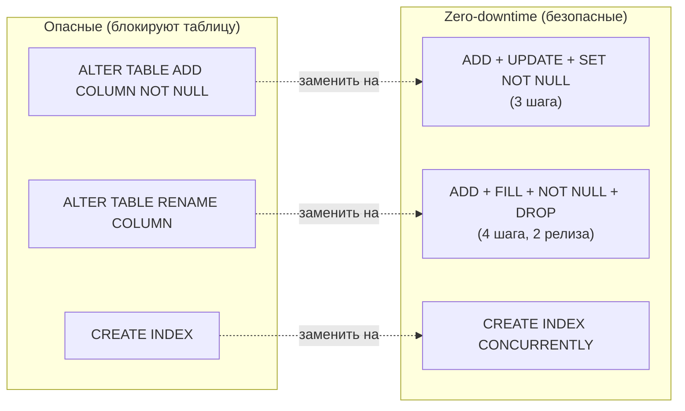

# Лабораторная работа №10
## Rollback, zero-downtime паттерны. Итоговая защита проекта eshop

**Неделя:** 13  
**Ориентировочное время:** 2 занятия (≈ 4 ак. ч.)

---

## Цель работы

- Применить forward rollback и undo-скрипты для проблемных миграций.
- Реализовать zero-downtime паттерны: переименование колонки, ADD NOT NULL, CREATE INDEX CONCURRENTLY.
- Подготовить и защитить итоговый отчёт по проекту `eshop`.

---

## Предварительные требования

- Завершена лаб. 09: Flyway настроен, миграции V001–V004 применены.
- Прочитана лек. 13.

---

## Часть 1. Rollback: forward rollback

### 1.1. Симуляция плохой миграции

Создайте `migrations/V005__bad_migration.sql`:

```sql
-- V005: ПЛОХАЯ миграция — добавляем NOT NULL без значения по умолчанию
ALTER TABLE orders ADD COLUMN manager_id INTEGER NOT NULL;
-- Ошибка: существующие строки не имеют значения manager_id
```

```bash
flyway -configFiles=flyway.toml migrate
# Ошибка: column "manager_id" of relation "orders" contains null values
```

```bash
flyway -configFiles=flyway.toml info
# V005 — Failed
```

### 1.2. Forward rollback (рекомендуемый подход)

Вместо попытки «откатить» — пишем корректирующую миграцию:

Создайте `migrations/V006__fix_manager_id.sql`:

```sql
-- V006: исправляем V005 — добавить с DEFAULT и потом снять DEFAULT
ALTER TABLE orders ADD COLUMN IF NOT EXISTS manager_id INTEGER DEFAULT NULL;
-- Если V005 провалилась до ALTER TABLE — эта строка создаст колонку безопасно
-- Если V005 создала колонку с ошибкой — подправим состояние
```

```bash
flyway -configFiles=flyway.toml repair
flyway -configFiles=flyway.toml migrate
flyway -configFiles=flyway.toml info
# V005 — Failed (помечена), V006 — Success
```

### 1.3. Undo-скрипт (альтернатива)

Flyway Undo — только в Flyway Teams. Имитируем вручную:

```sql
-- U005 (вручную): откат V005
ALTER TABLE orders DROP COLUMN IF EXISTS manager_id;
```

После выполнения undo-скрипта вручную:
```bash
flyway -configFiles=flyway.toml repair
# Помечает V005 как deleted
```

---

## Часть 2. Zero-downtime паттерны

> В production нельзя останавливать приложение на время миграции. Используем паттерны, безопасные при работающем трафике.

### 2.1. ADD NOT NULL (3-шаговый паттерн)

**Задача:** добавить `orders.confirmed_at TIMESTAMPTZ NOT NULL`.

```sql
-- Шаг 1: добавить колонку с DEFAULT (мгновенно, не блокирует)
ALTER TABLE orders ADD COLUMN confirmed_at TIMESTAMPTZ DEFAULT now();

-- Шаг 2: заполнить существующие строки (в production — батчами)
UPDATE orders SET confirmed_at = created_at WHERE confirmed_at IS NULL;

-- Шаг 3: добавить ограничение NOT NULL (быстро, т.к. данные уже заполнены)
ALTER TABLE orders ALTER COLUMN confirmed_at SET NOT NULL;
ALTER TABLE orders ALTER COLUMN confirmed_at DROP DEFAULT;
```

**Почему нельзя за один шаг?**
```sql
-- Этот запрос заблокирует таблицу на всё время заполнения строк:
ALTER TABLE orders ADD COLUMN confirmed_at TIMESTAMPTZ NOT NULL DEFAULT now();
-- В PostgreSQL 11+ это мгновенно из-за оптимизации DEFAULT в системный каталог,
-- но для pre-PG11 или при необходимости явного контроля — 3-шаговый вариант надёжнее.
```

Создайте миграцию `V007__add_confirmed_at_safe.sql` с этим кодом.

### 2.2. RENAME COLUMN (4-шаговый паттерн)

**Задача:** переименовать `customers.name` → `customers.full_name`.

```sql
-- Шаг 1: добавить новую колонку
ALTER TABLE customers ADD COLUMN full_name TEXT;

-- Шаг 2: заполнить
UPDATE customers SET full_name = name;

-- Шаг 3: добавить NOT NULL
ALTER TABLE customers ALTER COLUMN full_name SET NOT NULL;

-- Шаг 4: убрать старую колонку (когда все клиенты перешли на full_name)
ALTER TABLE customers DROP COLUMN name;
```

> **В production** шаги 3 и 4 выполняются в разных релизах: сначала оба столбца живут параллельно, приложение читает `full_name`, затем убирают `name`.

Создайте миграцию `V008__rename_customer_name.sql`.

### 2.3. CREATE INDEX CONCURRENTLY

```bash
# Индекс на большой таблице без блокировки записи
psql -h localhost -U postgres -d eshop -c "
CREATE INDEX CONCURRENTLY idx_orders_total_amount ON orders(total_amount DESC);
"
```

```sql
-- Проверить, что индекс VALID (не INVALID)
SELECT indexname, indisvalid
FROM   pg_indexes
JOIN   pg_class ON relname = tablename
JOIN   pg_index ON indexrelid = pg_class.oid
WHERE  tablename = 'orders' AND indexrelname = 'idx_orders_total_amount';
-- indisvalid = true — всё хорошо

-- Если indisvalid = false — удалить и пересоздать:
-- DROP INDEX CONCURRENTLY idx_orders_total_amount;
-- CREATE INDEX CONCURRENTLY ...;
```

### 2.4. Сводная таблица паттернов



| Операция               | Опасный способ          | Zero-downtime способ                         |
|------------------------|-------------------------|----------------------------------------------|
| ADD NOT NULL column    | Один ALTER TABLE        | ADD + UPDATE + SET NOT NULL (3 шага)         |
| RENAME COLUMN          | ALTER TABLE RENAME      | ADD + FILL + NOT NULL + DROP (2 релиза)      |
| CREATE INDEX           | CREATE INDEX            | CREATE INDEX CONCURRENTLY                    |
| DROP TABLE             | DROP TABLE              | RENAME → убрать FK → DROP (3 релиза)         |
| Изменить тип колонки   | ALTER COLUMN TYPE       | ADD + migrate + DROP (контролируемая пауза)  |

---

## Часть 3. Обслуживание и итоговое состояние базы

### 3.1. Полная VACUUM + REINDEX

```bash
# Через утилиты (терминал)
vacuumdb -h localhost -U postgres -d eshop --full --analyze --verbose

reindexdb -h localhost -U postgres -d eshop --concurrently --verbose
```

### 3.2. Статус всех миграций

```bash
flyway -configFiles=flyway.toml info
```

Скопируйте вывод в файл `final_flyway_status.txt`.

### 3.3. Итоговый слепок схемы

```bash
pg_dump -h localhost -U postgres --schema-only eshop \
    -f eshop_final_schema.sql
```

---

## Часть 4. Итоговая защита проекта

### 4.1. Структура отчёта

Подготовьте отчёт `eshop_project_report.md`:

```markdown
## Итоговый отчёт: проект eshop

**Студент:** ___  
**Группа:** ___  
**Дата:** ___

### 1. Описание базы данных
- Назначение eshop
- ERD (вставьте Mermaid-диаграмму из лаб. 02, обновлённую с новыми таблицами)

### 2. Ролевая модель
- Список ролей и их назначение (из лаб. 02)
- RLS: какие политики настроены

### 3. Резервное копирование
- Регламент (из лаб. 03)
- RPO / RTO для eshop (ваши целевые значения)

### 4. Мониторинг
- Ключевые метрики: cache hit ratio, dead_pct, idle in transaction
- Пороговые значения для алертов

### 5. Производительность
- Какие индексы созданы и почему
- Изменения настроек autovacuum
- Итог: используется ли PgBouncer? Почему?

### 6. Информационная безопасность
- pgAudit: что аудируется
- TLS: включён?
- Шифрование: какие поля зашифрованы
- Соответствие 152-ФЗ: категория ПДн, меры защиты

### 7. Управление миграциями
- Список всех Flyway-миграций (версия + описание)
- Один инцидент: что пошло не так, как восстановили

### 8. Zero-downtime
- Какие паттерны применили в лаб. 10
- Почему «опасный» способ неприемлем в production

### 9. Итоги и выводы
Что нового узнали. Что применимо на вашей текущей/будущей работе.
```

### 4.2. Вопросы для устной защиты

Преподаватель задаёт 3–5 вопросов из списка:

1. Чем `pg_dump` отличается от `pg_basebackup`? Когда что выбрать?
2. Что произойдёт, если `autovacuum` отключить на 1 неделю?
3. Объясните MVCC: почему `DELETE` не сразу освобождает место?
4. В чём разница между Seq Scan и Index Scan? Когда планировщик выбирает Seq Scan?
5. Что такое `pg_hba.conf`? Порядок обработки правил.
6. Почему `flyway clean` отключён в production?
7. Что такое WAL? Зачем PostgreSQL пишет изменения дважды?
8. Объясните: почему `ADD COLUMN NOT NULL DEFAULT` могло заблокировать таблицу в PG 10?
9. Какие события аудирует pgAudit в вашей конфигурации?
10. Что такое PITR? В каком сценарии он нужен?

---

## Чек-лист «работа зачтена»

- [ ] V007 (ADD NOT NULL) и V008 (RENAME COLUMN) — applied, Success.
- [ ] `idx_orders_total_amount` создан CONCURRENTLY; `indisvalid = true`.
- [ ] `vacuumdb --full` выполнен; `reindexdb --concurrently` выполнен.
- [ ] `flyway info` — все миграции V001–V008 Applied/Success.
- [ ] `eshop_project_report.md` — все разделы заполнены.
- [ ] Устная защита: ответы на 3 вопроса преподавателя.

---

## Ссылки

- Undo migrations: https://documentation.red-gate.com/fd/undo-migrations-184127461.html
- ADD NOT NULL safely: https://www.depesz.com/2018/05/10/waiting-for-postgresql-11-fast-alter-table-add-column-with-a-non-null-default/
- Zero-downtime рецепты: https://gist.github.com/jcoleman/1e6ad1bf8de454c166da94b67537758
- VACUUM FULL: https://www.postgresql.org/docs/current/sql-vacuum.html
