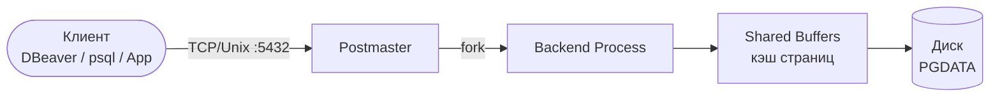
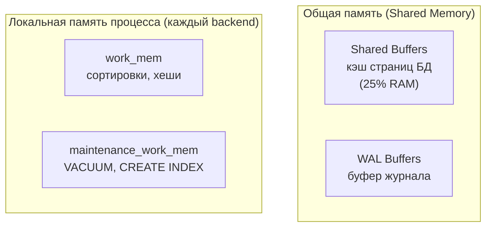
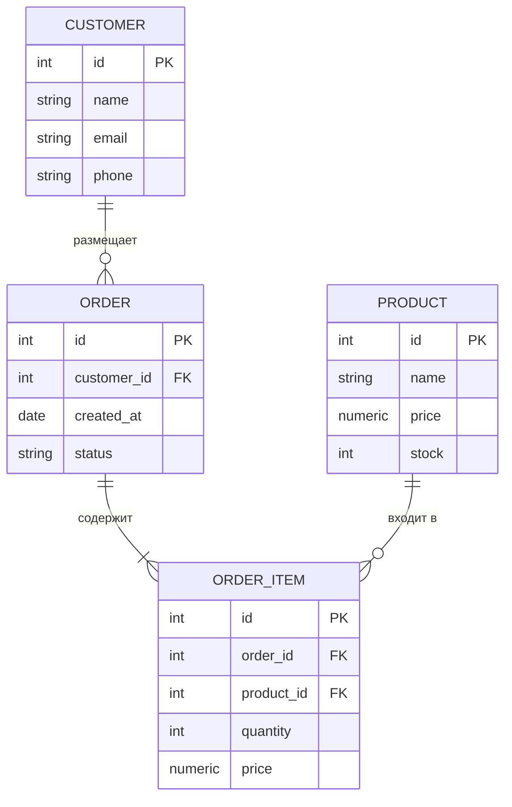

# Лекция 1. Роль DBA в команде. Архитектура PostgreSQL. Коммуникация в команде

**Неделя:** 1

---

## Цель лекции

По итогам лекции студент:

- понимает роль DBA в продуктовой команде и как она соотносится с ролью системного аналитика;
- знает архитектуру PostgreSQL на уровне, достаточном для осмысленного общения с DBA;
- умеет сформулировать задачу к DBA, локализовать проблему пользователя и оформить тикет.

---

## 1. Роли в команде, работающей с БД

В продуктовой команде вопросами базы данных занимаются несколько ролей одновременно. Системному аналитику важно понимать зоны ответственности каждой, чтобы ставить задачи правильному человеку и говорить на одном языке.

| Роль                    | Зона ответственности                                                                 | С кем взаимодействует                  |
|-------------------------|--------------------------------------------------------------------------------------|----------------------------------------|
| **DBA**                 | Установка, конфигурация, бэкапы, восстановление, права доступа, мониторинг, оптимизация | Разработчик, аналитик, DevOps          |
| **Системный аналитик**  | Требования к данным, модель предметной области, migration plan, приёмка изменений схемы | DBA, разработчик, бизнес-заказчик      |
| **Разработчик**         | SQL-запросы, ORM, написание скриптов миграций, unit-тесты                            | DBA, аналитик                          |
| **DevOps / SRE**        | CI/CD pipeline, запуск `flyway migrate`, мониторинг инфраструктуры                   | DBA, разработчик                       |
| **Пользователь / бизнес** | Формулировка потребностей, приёмка результата                                      | Аналитик                               |

### Где пересекаются аналитик и DBA

Ключевые точки пересечения, где аналитик обязан говорить с DBA на одном языке:

1. **Проектирование схемы** — аналитик предлагает модель, DBA оценивает реализуемость и производительность.
2. **Migration plan** — аналитик пишет документ, DBA делает review SQL-скриптов.
3. **Управление доступом** — аналитик формулирует, кому нужны какие права; DBA реализует.
4. **Инциденты** — пользователь приходит к аналитику с проблемой; аналитик локализует и передаёт DBA.
5. **Оценка производительности** — аналитик ставит требования по SLA; DBA проверяет план запроса.

---

## 2. Архитектура PostgreSQL

### 2.1. Клиент-серверная модель

PostgreSQL работает по классической клиент-серверной архитектуре. Клиент (DBeaver, psql, приложение) подключается к серверу по TCP (порт 5432 по умолчанию) или через Unix-сокет. Сервер для каждого соединения порождает отдельный процесс-обработчик (backend process).



### 2.2. Процессы сервера

| Процесс           | Роль                                                                              |
|-------------------|-----------------------------------------------------------------------------------|
| **postmaster**    | Главный процесс; принимает входящие соединения и порождает backend-процессы       |
| **backend**       | Обслуживает одно клиентское соединение; выполняет SQL, работает с кэшем           |
| **bgwriter**      | Асинхронно сбрасывает «грязные» страницы из shared buffers на диск               |
| **WAL writer**    | Записывает журнал предзаписи (WAL) на диск                                       |
| **checkpointer**  | Периодически создаёт контрольные точки: синхронизирует память и диск              |
| **autovacuum**    | Очищает мёртвые версии строк после UPDATE/DELETE, обновляет статистику планировщика |

### 2.3. Память



- **shared_buffers** — сколько RAM PostgreSQL использует как кэш страниц; типичное значение — 25% RAM сервера.
- **work_mem** — память на одну операцию сортировки или хеш-соединения. При сложном запросе с несколькими узлами сортировки каждый узел получает свой `work_mem`, и это умножается на число параллельных соединений. Пример: 50 соединений × 5 узлов × 64 MB = 16 GB — реальный риск OOM. Значение выше 16–32 MB требует тщательного обдумывания.
- **WAL Buffers** — буфер для журнала предзаписи перед записью на диск.

### 2.4. Хранение данных на диске (PGDATA)

```
PGDATA/
├── base/               ← базы данных (каждая — отдельная папка по OID)
│   ├── 1/              ← системная БД template1
│   └── 16384/          ← пользовательская БД (OID)
├── global/             ← объекты уровня кластера (роли, таблицы pg_database)
├── pg_wal/             ← файлы WAL (журнал предзаписи)
├── log/                ← файлы логов сервера (настраивается параметром log_directory)
├── postgresql.conf     ← основной файл конфигурации
├── pg_hba.conf         ← правила аутентификации клиентов
├── postgresql.auto.conf ← параметры, изменённые через ALTER SYSTEM; перекрывает postgresql.conf
└── PG_VERSION           ← версия кластера
```

### 2.5. Иерархия объектов

```
Кластер PostgreSQL (один экземпляр СУБД, один PGDATA)
└── База данных (CREATE DATABASE)
    └── Схема (CREATE SCHEMA)
        ├── Таблица
        ├── Представление (VIEW)
        ├── Функция
        └── Индекс
```

Важно: **роли (пользователи) существуют на уровне кластера**, а не базы данных. Привилегии на объекты — на уровне базы.

### 2.6. Write-Ahead Log (WAL)

WAL — журнал предзаписи. Каждое изменение данных сначала записывается в WAL, и только потом применяется к файлам данных. Это гарантирует:

- **Durability** (надёжность): при сбое данные восстанавливаются из WAL.
- **Репликацию**: standby-сервер воспроизводит WAL от primary.
- **PITR**: архив WAL позволяет восстановиться на любой момент времени.

> **Параметр `synchronous_commit`** — определяет, ждать ли подтверждения записи WAL на диск перед ответом клиенту. `on` (по умолчанию) — максимальная надёжность; `off` — выше скорость, но при сбое возможна потеря последних нескольких транзакций (данные не повредятся, но последние записи могут быть утеряны). Это ключевой параметр компромисса надёжность/производительность.

---

## 3. Обзор PostgreSQL

### 3.1. Краткая история

PostgreSQL берёт начало от проекта POSTGRES (Беркли, 1986); в 1996 переименован и получил полноценный SQL. Каждая major-версия поддерживается **5 лет**; минорные (патчи безопасности) выходят ежеквартально. Актуальные версии: https://www.postgresql.org/support/versioning/

### 3.2. Ключевые возможности

- **ACID-транзакции** с уровнями изоляции (Read Committed, Repeatable Read, Serializable).
- **MVCC** (Multi-Version Concurrency Control) — читатели не блокируют писателей.
- **Расширяемость** — пользовательские типы, операторы, индексные методы, расширения.
- **Полнотекстовый поиск**, поддержка JSON/JSONB, массивы, диапазонные типы.
- **Логическая и физическая репликация** из коробки.
- **Row-Level Security** (RLS) — политики безопасности на уровне строк.

### 3.3. Политика поддержки версий

PostgreSQL поддерживает каждую major-версию **5 лет**. Минорные версии (патчи безопасности и исправления) выходят ежеквартально.

Актуальные версии: https://www.postgresql.org/support/versioning/

### 3.4. Экосистема расширений

PostgreSQL расширяется без изменения ядра: PostGIS (геоданные), pgvector (AI/ML-поиск), TimescaleDB (временны́е ряды), pgAudit (аудит), Citus (горизонтальное масштабирование) и десятки других. Каждое расширение разобрано в темах докладов — см. `docs/reports.md`, блок A.

---

## 4. Диаграммы сущность-связь (ERD)

ERD (Entity-Relationship Diagram) — основной инструмент документирования структуры данных. Аналитик использует ERD при проектировании схемы, составлении migration plan и в коммуникации с DBA.

### 4.1. Нотация «Воронья лапка» (Crow's Foot)

Самая распространённая нотация ERD. Каждая таблица — прямоугольник; линии показывают связи. Конец линии у сущности означает кардинальность (сколько записей участвует):

| Символ на конце линии | Смысл                          |
|-----------------------|--------------------------------|
| `||`                  | Ровно один (обязательно)        |
| `|o`                  | Ноль или один (необязательно)   |
| `}|`                  | Один или много (обязательно)    |
| `}o`                  | Ноль или много (необязательно)  |

### 4.2. Пример ERD в Mermaid (нотация Crow's Foot)

Упрощённая схема интернет-магазина:



### 4.3. Как читать ERD при работе с DBA

При получении migration plan или review MR с миграцией аналитик проверяет:

| Вопрос при чтении ERD                           | Что проверять в SQL-скрипте                       |
|-------------------------------------------------|---------------------------------------------------|
| Есть ли первичный ключ у каждой таблицы?        | `PRIMARY KEY` или `GENERATED ALWAYS AS IDENTITY`  |
| Корректны ли кардинальности связей?             | `FOREIGN KEY ... REFERENCES`, `ON DELETE`-правило |
| Нет ли циклических зависимостей?                | Порядок `CREATE TABLE` / `DROP TABLE`             |
| Соответствуют ли типы данных требованиям?       | `VARCHAR` vs `TEXT`, `NUMERIC(p,s)` vs `FLOAT`    |

### 4.4. Инструменты для ERD

| Инструмент         | Подход                                           | Ссылка                                          |
|--------------------|--------------------------------------------------|-------------------------------------------------|
| **Mermaid**        | Код → диаграмма; встраивается в Markdown/GitLab/GitHub | https://mermaid.js.org/syntax/entityRelationshipDiagram.html |
| **PlantUML**       | Текстовый DSL; мощнее Mermaid; поддержка в IDE  | https://plantuml.com/ie-diagram                 |
| **DBeaver**        | Автогенерация ERD из существующей схемы БД       | Правый клик по схеме → **ER Diagram**           |
| **draw.io**        | Визуальный редактор; экспорт в PNG/SVG           | https://www.drawio.com                          |
| **dbdiagram.io**   | DSL-язык (DBML); быстрое создание ERD онлайн    | https://dbdiagram.io                            |

---

## 5. Нормализация и типы данных

### 5.1. Нормальные формы (кратко)

Нормализация — процесс проектирования реляционной схемы, устраняющий дублирование и аномалии при изменении данных.

| Форма | Условие                                                               | Типичная аномалия, которую устраняет   |
|-------|-----------------------------------------------------------------------|----------------------------------------|
| 1НФ   | Все атрибуты атомарны (нет списков, нет вложенных таблиц)             | «Телефоны через запятую» в одной ячейке |
| 2НФ   | 1НФ + каждый неключевой атрибут полностью зависит от всего ключа      | Дублирование данных при составном PK   |
| 3НФ   | 2НФ + нет транзитивных зависимостей между неключевыми атрибутами      | Изменение города тянет изменение индекса |

**Практическое правило:** для большинства OLTP-схем достаточно 3НФ. Денормализация (намеренное нарушение) применяется для аналитики (OLAP) или кэширующих таблиц — только при доказанной необходимости.

#### Пример: нарушение 3НФ

```
orders(id, customer_id, customer_city, customer_region)
```

`customer_city` → `customer_region` — транзитивная зависимость.  
Решение: вынести `city_id → region` в справочник `cities`.

#### Упражнение: найдите нарушение

Дана таблица:

```
employees(id, name, department_id, department_name, department_head_name)
```

Вопросы для самопроверки:
1. В какой нормальной форме эта таблица?
2. Какие аномалии возможны? (Подсказка: что произойдёт, если переименовать отдел?)
3. Как разбить таблицу на 3НФ? Нарисуйте ERD с двумя таблицами.

### 5.2. Ключевые типы данных PostgreSQL

Выбор типа влияет на размер строки, точность вычислений и производительность индексов.

| Задача                         | Рекомендуемый тип     | Почему                                                       |
|--------------------------------|-----------------------|--------------------------------------------------------------|
| Целые идентификаторы           | `BIGSERIAL` / `BIGINT GENERATED ALWAYS AS IDENTITY` | Запас диапазона; `SERIAL` устарел    |
| Денежные суммы                 | `NUMERIC(p, s)`       | Точная арифметика; `FLOAT` даёт ошибки округления            |
| Произвольный текст             | `TEXT`                | В PostgreSQL нет штрафа за `TEXT` vs `VARCHAR(n)`            |
| Дата + время с часовым поясом  | `TIMESTAMPTZ`         | Хранит в UTC, отдаёт с учётом `TimeZone` сеанса             |
| Дата + время без часового пояса| `TIMESTAMP`           | Только если вы точно знаете, что ЧП не нужен                |
| Логические значения            | `BOOLEAN`             | Не используйте `CHAR(1)` или `SMALLINT`                      |
| UUID как PK                    | `UUID`                | Удобен в распределённых системах; можно комбинировать с `gen_random_uuid()` |
| JSON-документ                  | `JSONB`               | Бинарный; поддерживает индексы GIN; `JSON` только для хранения «как есть» |

> **Антипаттерн:** `VARCHAR(255)` везде — характерная ошибка из мира MySQL. В PostgreSQL `TEXT` семантически идентичен и проще в сопровождении.

---

## 6. Коммуникация DBA–аналитик–пользователь (ТФ A/07.4)

### 6.1. Типичные проблемы, с которыми пользователи приходят к аналитику

| Жалоба пользователя                                | Возможная причина на уровне БД              |
|----------------------------------------------------|---------------------------------------------|
| «Отчёт строится очень долго»                       | Медленный запрос, отсутствие индекса        |
| «Данные не сохраняются / откатились»               | Ошибка транзакции, constraint violation     |
| «Не могу войти / нет прав»                         | Отсутствие роли или привилегий              |
| «Дублируются записи»                               | Нарушение логики уникальности               |
| «Всё зависло»                                      | Блокировка, долгая транзакция, deadlock     |
| «Данные пропали»                                   | Удаление без WHERE, проблема с миграцией    |
| «Соединение разрывается / timeout»                 | Исчерпан `max_connections`, connection pool |
| «Нет места на диске»                               | Раздулись WAL-файлы или bloat таблиц        |

### 6.2. Алгоритм локализации проблемы

Прежде чем эскалировать проблему к DBA, аналитик должен собрать первичную информацию:

```
1. Воспроизвести проблему:
   — Это происходит всегда или иногда?
   — На каком конкретном действии / данных?

2. Уточнить контекст:
   — Когда началось? Были ли изменения в системе?
   — Какие данные затронуты (таблица, период)?

3. Собрать артефакты:
   — Скриншот / текст ошибки
   — Время возникновения (точное!)
   — Имя пользователя / роль в системе

4. Сформулировать тикет → передать DBA
```

### 6.3. Шаблон тикета к DBA

```
Тема: [Кратко суть проблемы, например: "Отчёт по продажам выполняется > 5 мин"]

Среда: production / staging / local
Время возникновения: 2026-09-02 14:35 MSK
Частота: постоянно / периодически
Версия PostgreSQL: <SELECT version(); — скопировать вывод>
Был ли деплой / миграция непосредственно перед проблемой: да / нет / не знаю

Описание:
  Пользователь <имя/роль> сообщает, что <что происходит>.
  Воспроизводится при <условие>.

Ожидаемое поведение:
  <что должно происходить>

Фактическое поведение / текст ошибки:
  <скопировать сообщение об ошибке целиком>

Затронутые объекты:
  — БД: <имя базы>
  — Таблица / объект: <имя>
  — Пользователь БД: <роль>

Приоритет: критично / высокий / обычный
Дедлайн: <если есть>
```

### 6.4. Эскалация инцидента ИБ

Если проблема связана с безопасностью (подозрительный доступ, утечка, несанкционированные изменения):

1. **Не пытаться исправить самостоятельно** — это может уничтожить следы инцидента. В частности: не удалять лог-файлы, не изменять данные, не перезапускать сервис без согласования со службой ИБ.
2. Зафиксировать время, пользователя, действие.
3. Передать в **службу ИБ** и **DBA одновременно**.
4. DBA может временно заблокировать доступ подозрительному пользователю.
5. Не сообщать об инциденте публично до завершения расследования.

---

## 7. Итоги лекции

После этой лекции студент умеет:

- **Объяснить зоны ответственности** DBA, аналитика и разработчика и назвать 5 точек пересечения.
- **Описать архитектуру PostgreSQL**: что делают postmaster, backend, bgwriter, autovacuum; чем shared_buffers отличается от work_mem.
- **Прочитать ERD** в нотации Crow's Foot: определить кардинальность связей, найти FK и PK, выявить денормализацию.
- **Применить нормальные формы**: объяснить 1НФ/2НФ/3НФ на примере; выбрать подходящий тип данных (`NUMERIC` vs `FLOAT`, `TEXT` vs `VARCHAR(n)`, `TIMESTAMPTZ` vs `TIMESTAMP`).
- **Оформить тикет к DBA** по стандартному шаблону: среда, время, артефакты, ожидаемое vs фактическое.

---

## Ссылки

**Обязательно перед лаб. 02:**
- Документация PostgreSQL — архитектура: https://www.postgresql.org/docs/current/overview.html (главы Overview и Processes)

**Для углубления:**
- Процессы и память: https://www.postgresql.org/docs/current/processes.html
- ERD в Mermaid: https://mermaid.js.org/syntax/entityRelationshipDiagram.html
- Политика поддержки версий: https://www.postgresql.org/support/versioning/

**Нормативная база курса:**
- Профстандарт 06.011 (Минтруд РФ): https://mintrud.gov.ru/docs/2512
