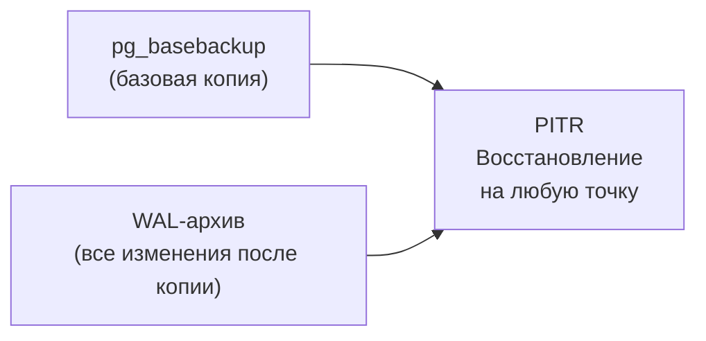

# Лекция 5. Резервное копирование: pg_dump, pg_basebackup, WAL-архивирование

**Неделя:** 5

---

## Цель лекции

По итогам лекции студент:

- знает параметры надёжности RPO и RTO и умеет применять их при обсуждении стратегии бэкапа с DBA;
- понимает разницу между логическим и физическим резервным копированием;
- знает команды `pg_dump`, `pg_dumpall`, `pg_basebackup` и основные их параметры;
- понимает роль WAL-архивирования в обеспечении PITR.

---

## 1. RPO и RTO: параметры надёжности

Прежде чем настраивать резервное копирование, нужно договориться о требованиях:

| Параметр | Расшифровка                           | Пример                                          |
|----------|---------------------------------------|-------------------------------------------------|
| **RPO**  | Recovery Point Objective — допустимая потеря данных (в единицах времени) | «Допустимо потерять не более 1 часа транзакций» |
| **RTO**  | Recovery Time Objective — допустимое время восстановления сервиса | «Сервис должен быть восстановлен за 4 часа» |

**Зависимость от стратегии:**

| Стратегия                           | Достижимый RPO        | Достижимый RTO              |
|-------------------------------------|-----------------------|-----------------------------|
| Ручной pg_dump раз в сутки         | до 24 часов           | часы (время pg_restore)     |
| pg_dump каждый час                  | до 1 часа             | часы                        |
| pg_basebackup + WAL-архив (PITR)    | секунды / минуты      | 1–4 часа (зависит от объёма WAL) |
| Streaming replication (standby)     | секунды               | минуты (переключение)       |

> **Задача аналитика:** договориться с бизнесом о требованиях RPO/RTO и передать их DBA в виде числовых значений. «Как можно быстрее» — не требование.

---

## 2. Логические дампы: pg_dump

`pg_dump` создаёт логический экспорт — набор SQL-команд для воссоздания объектов и данных.

### 2.1. Форматы

| Формат         | Флаг      | Характеристики                                                      |
|----------------|-----------|---------------------------------------------------------------------|
| Plain SQL      | `-Fp`     | Читаемый текстовый файл; восстанавливается через `psql`             |
| Custom (binary)| `-Fc`     | Сжатый; поддерживает выборочное восстановление и параллельный `pg_restore` |
| Directory      | `-Fd`     | Папка с файлами; лучший для параллельного дампа (`-j N`)            |
| Tar            | `-Ft`     | Tar-архив; менее гибкий                                             |

**Рекомендация:** использовать custom-формат (`-Fc`) — сжатие + выборочное восстановление.

### 2.2. Основные команды

```bash
# Полный дамп базы в custom-формате (рекомендуется)
pg_dump -h localhost -U postgres -Fc myapp_prod -f myapp_prod_$(date +%Y%m%d).dump

# Только схема (без данных)
pg_dump -h localhost -U postgres --schema-only myapp_prod -f schema.sql

# Только данные (без схемы)
pg_dump -h localhost -U postgres --data-only myapp_prod -f data.sql

# Конкретная таблица
pg_dump -h localhost -U postgres -t orders myapp_prod -f orders.sql

# Исключить таблицу (например, большой аудит-лог)
pg_dump -h localhost -U postgres --exclude-table=audit_log myapp_prod -f noaudit.dump

# Параллельный дамп в directory-формате (быстрее на многоядерных серверах)
pg_dump -h localhost -U postgres -Fd -j 4 myapp_prod -f myapp_dump_dir/
```

### 2.3. Ограничения логического дампа

- Не включает глобальные объекты кластера: **роли и табличные пространства** — для них нужен `pg_dumpall`.
- При восстановлении большой БД — медленно: нужно заново построить все индексы.
- Нельзя восстановить «на момент времени» (нет PITR).

---

## 3. Дамп кластера: pg_dumpall

`pg_dumpall` создаёт дамп **всего кластера PostgreSQL**, включая глобальные объекты (роли, пароли, табличные пространства), которые `pg_dump` не захватывает.

```bash
# Полный дамп кластера (только plain SQL)
pg_dumpall -h localhost -U postgres -f cluster_full.sql

# Только глобальные объекты (роли, табличные пространства)
pg_dumpall -h localhost -U postgres --globals-only -f globals.sql
```

> При полном восстановлении кластера с нуля: сначала `psql -f globals.sql` (роли), затем `pg_restore` или `psql` для каждой базы.

---

## 4. Физическое резервное копирование: pg_basebackup

`pg_basebackup` создаёт **физическую копию всего PGDATA-каталога** — двоичный снимок на уровне файловой системы.

### 4.1. Когда использовать pg_basebackup

| Сценарий                                        | pg_dump | pg_basebackup |
|-------------------------------------------------|---------|---------------|
| Выборочное восстановление одной таблицы         | ✓       | —             |
| Быстрое полное восстановление большой базы      | —       | ✓             |
| Основа для PITR                                 | —       | ✓             |
| Инициализация реплики                           | —       | ✓             |
| Переносимость между ОС / версиями               | ✓       | —             |

### 4.2. Команды

```bash
# Физическая копия в директорию (онлайн, без остановки сервера)
pg_basebackup -h localhost -U replication_user -D /backup/basebackup/ -Fp -Xs -P

# С упаковкой в tar + gzip
pg_basebackup -h localhost -U replication_user -D /backup/ -Ft -z -Xs -P
# -D   — куда сохранить
# -Fp  — формат plain (файловая иерархия как PGDATA)
# -Ft  — формат tar
# -Xs  — включить WAL-файлы, нужные для восстановления
# -P   — показывать прогресс
# -z   — gzip-сжатие (только с -Ft)
```

### 4.3. Требования

```sql
-- Роль для репликации
CREATE ROLE replication_user REPLICATION LOGIN PASSWORD 'secret';
```

```
# pg_hba.conf
host    replication    replication_user    127.0.0.1/32    scram-sha-256
```

---

## 5. WAL-архивирование: основа PITR

### 5.1. Как это работает

WAL-архивирование — непрерывная копия журналов предзаписи в отдельное хранилище. В сочетании с `pg_basebackup` позволяет восстановить базу **на любой момент времени**.



### 5.2. Настройка WAL-архивирования

```ini
# postgresql.conf
wal_level           = replica
archive_mode        = on
archive_command     = 'cp %p /mnt/wal_archive/%f'
# Для S3:
# archive_command   = 'aws s3 cp %p s3://mybucket/wal/%f'
archive_timeout     = 300       # форсировать ротацию WAL каждые 5 минут
```

`%p` — полный путь к WAL-файлу, `%f` — только имя файла.

### 5.3. Проверка архивирования

```sql
SELECT * FROM pg_stat_archiver;
-- last_archived_wal     — последний успешно заархивированный WAL
-- failed_count > 0      — ошибка: archive_command не работает!

-- Принудительно переключить WAL-файл
SELECT pg_switch_wal();
```

---

## 6. Стратегия резервного копирования

### 6.1. Трёхуровневая стратегия

| Уровень         | Инструмент       | Частота    | Назначение                                            |
|-----------------|------------------|------------|-------------------------------------------------------|
| Полный бэкап    | pg_basebackup    | Еженедельно| Базовая точка для PITR; полное восстановление         |
| Логический дамп | pg_dump          | Ежедневно  | Выборочное восстановление таблиц; переносимость       |
| WAL-архив       | archive_command  | Непрерывно | PITR: восстановление с точностью до транзакции        |

### 6.2. Правило 3-2-1

- **3** копии данных
- на **2** различных носителях/системах хранения
- **1** копия — вне площадки (offsite / cloud)

---

## 7. Проверка резервной копии

```bash
# Проверить целостность custom-дампа
pg_restore --list myapp_prod_20240901.dump | head -30

# Полноценная проверка: восстановить в тестовую базу
createdb myapp_test_restore
pg_restore -d myapp_test_restore -Fc myapp_prod_20240901.dump

# Проверить количество строк в ключевых таблицах
psql -d myapp_test_restore -c "SELECT COUNT(*) FROM orders;"
```

> **Задача аналитика:** при постановке требований указывать **частоту проверки** восстановления. Нетестируемый бэкап обнаруживается только в момент катастрофы.

---

## 8. Итоги лекции

После этой лекции студент умеет:

- **Согласовать RPO/RTO** с бизнесом и объяснить, какой метод бэкапа их обеспечивает.
- **Выполнить `pg_dump -Fc`** и проверить результат через `pg_restore --list`.
- **Объяснить**, зачем нужен `pg_dumpall --globals-only` и что произойдёт без него при переносе на новый сервер.
- **Снять физическую копию** через `pg_basebackup -Fp -Xs -P` и объяснить содержимое папки.
- **Настроить WAL-архивирование**: `archive_mode=on`, `archive_command`, проверить через `pg_stat_archiver`.
- **Составить регламент** резервного копирования по правилу 3-2-1 с конкретными частотой и сроком хранения.

---

## Ссылки

- pg_dump: https://www.postgresql.org/docs/current/app-pgdump.html
- pg_dumpall: https://www.postgresql.org/docs/current/app-pg-dumpall.html
- pg_basebackup: https://www.postgresql.org/docs/current/app-pgbasebackup.html
- WAL-архивирование: https://www.postgresql.org/docs/current/continuous-archiving.html
- pg_stat_archiver: https://www.postgresql.org/docs/current/monitoring-stats.html#MONITORING-PG-STAT-ARCHIVER-VIEW
