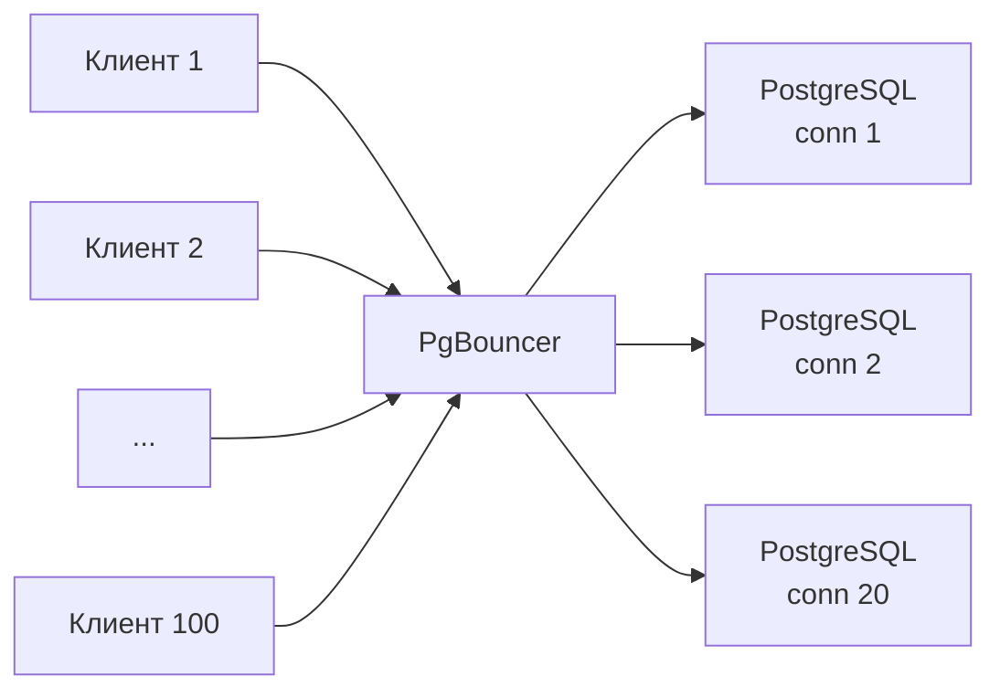

# Лекция 9. Оптимизация производительности. Индексы. Connection Pooling. Обоснование модернизации

**Неделя:** 9

---

## Цель лекции

По итогам лекции студент:

- знает типы индексов PostgreSQL и умеет выбрать подходящий;
- понимает роль автовакуума в производительности и умеет диагностировать его проблемы;
- знает, зачем нужен connection pooler, и понимает режимы работы PgBouncer;
- умеет составить обоснование модернизации программно-аппаратного обеспечения (ПАО).

---

## 1. Индексы PostgreSQL

### 1.1. Типы индексов

| Тип       | Применение                                                   | Пример                                         |
|-----------|--------------------------------------------------------------|------------------------------------------------|
| **B-tree** | Равенство, диапазоны (`=`, `<`, `>`, `BETWEEN`, `LIKE 'prefix%'`); по умолчанию | `CREATE INDEX ON orders(created_at)` |
| **Hash**  | Только равенство (`=`); редко лучше B-tree                   | `CREATE INDEX USING HASH ON users(token)` |
| **GIN**   | Массивы, JSONB, полнотекстовый поиск                         | `CREATE INDEX USING GIN ON products(tags)` |
| **GiST**  | Геометрические типы (PostGIS), диапазоны                     | `CREATE INDEX USING GIST ON locations(geom)` |
| **BRIN**  | Очень большие таблицы с физически отсортированными данными   | `CREATE INDEX USING BRIN ON events(logged_at)` |

### 1.2. Специальные виды индексов

**Частичный (partial) индекс:**
```sql
-- Индекс только по активным заказам
CREATE INDEX idx_orders_pending ON orders(customer_id)
WHERE status = 'pending';
```

**Индекс по выражению:**
```sql
-- Поиск без учёта регистра
CREATE INDEX idx_users_email_lower ON users(lower(email));
-- Используется: WHERE lower(email) = lower('user@example.com');
```

**Составной (composite) индекс:**
```sql
CREATE INDEX idx_orders_customer_date ON orders(customer_id, created_at);
-- Используется: WHERE customer_id = ? AND created_at > ?
-- НЕ используется: WHERE created_at > ?  (customer_id не первым)
```

### 1.3. CREATE INDEX CONCURRENTLY

```sql
-- Без блокировки DML-операций (медленнее; нельзя внутри транзакции)
CREATE INDEX CONCURRENTLY idx_orders_created ON orders(created_at);

-- Если завершился с ошибкой — остаётся INVALID-индекс; удалить и пересоздать:
SELECT indexname FROM pg_indexes
WHERE  indexname = 'idx_orders_created'
  AND  NOT EXISTS (SELECT 1 FROM pg_index WHERE indisvalid AND indexrelid = (schemaname||'.'||tablename)::regclass);

DROP INDEX CONCURRENTLY idx_orders_created;
```

### 1.4. Диагностика неиспользуемых индексов

```sql
SELECT schemaname, relname AS table_name, indexrelname AS index_name,
       pg_size_pretty(pg_relation_size(indexrelid)) AS index_size,
       idx_scan
FROM   pg_stat_user_indexes
WHERE  idx_scan = 0
  AND  indexrelname NOT LIKE '%pkey%'
ORDER  BY pg_relation_size(indexrelid) DESC;
```

---

## 2. Автовакуум и его роль в производительности

### 2.1. Почему важен autovacuum

| Если autovacuum не успевает...          | Последствие                                         |
|-----------------------------------------|-----------------------------------------------------|
| Накапливаются мёртвые строки            | Bloat: таблица растёт, сканирование замедляется     |
| Устаревает статистика                   | Планировщик выбирает неоптимальный план             |
| XID wraparound приближается             | PostgreSQL принудительно запускает VACUUM; в крайнем случае — аварийная остановка |

### 2.2. Диагностика

```sql
SELECT relname,
       n_dead_tup,
       n_live_tup,
       ROUND(n_dead_tup::numeric / NULLIF(n_live_tup + n_dead_tup,0)*100, 1) AS dead_pct,
       last_autovacuum,
       last_autoanalyze
FROM   pg_stat_user_tables
WHERE  n_dead_tup > 10000
ORDER  BY dead_pct DESC;
```

### 2.3. Ключевые параметры autovacuum

```ini
autovacuum_vacuum_threshold      = 50
autovacuum_vacuum_scale_factor   = 0.2   # для больших таблиц слишком много

# Для больших таблиц — задать через storage параметры:
# ALTER TABLE big_table SET (autovacuum_vacuum_scale_factor = 0.01);

autovacuum_analyze_scale_factor  = 0.1
autovacuum_vacuum_cost_delay     = 2ms
```

---

## 3. Connection Pooling: PgBouncer

### 3.1. Зачем нужен connection pooler

Каждое подключение к PostgreSQL — отдельный OS-процесс (~5–10 МБ памяти). 200 воркеров приложения создают 200 backend-процессов.



### 3.2. Режимы работы

| Режим         | Соединение держится...            | Совместимость                 | Рекомендация              |
|---------------|-----------------------------------|-------------------------------|---------------------------|
| **Session**   | Весь сеанс клиента                | Полная                        | Безопасно; не даёт выигрыша при коротких запросах |
| **Transaction** | Время транзакции               | Большинство приложений        | **Рекомендуется**         |
| **Statement** | Время одного SQL-запроса          | Без транзакций                | Редкий; осторожно         |

### 3.3. Конфигурация pgbouncer.ini

```ini
[databases]
myapp_prod = host=localhost port=5432 dbname=myapp_prod

[pgbouncer]
listen_addr         = *
listen_port         = 6432
auth_type           = scram-sha-256
auth_file           = /etc/pgbouncer/userlist.txt

pool_mode           = transaction
max_client_conn     = 1000
default_pool_size   = 20
min_pool_size       = 5
server_idle_timeout = 600
```

### 3.4. Ограничения transaction mode

В transaction-режиме **не работают:**
- `SET` с постоянным эффектом
- Серверные prepared statements
- Временные таблицы
- `LISTEN` / `NOTIFY`

---

## 4. Capacity Planning

| Метрика                          | Пороговое значение                    | Действие                                     |
|----------------------------------|---------------------------------------|----------------------------------------------|
| Cache hit ratio                  | < 99% (устойчиво)                     | Увеличить `shared_buffers` / RAM             |
| Disk I/O utilization             | > 70% (устойчиво)                     | Перейти на SSD / NVMe                        |
| CPU utilization                  | > 70% (устойчиво)                     | Оптимизация запросов; масштабирование         |
| Active connections               | > 80% от `max_connections`            | Добавить PgBouncer                           |
| Disk free space                  | < 20%                                 | Расширить хранилище                          |

```sql
-- Топ таблиц по размеру
SELECT relname,
       pg_size_pretty(pg_total_relation_size(relid)) AS total_size,
       pg_size_pretty(pg_relation_size(relid))       AS table_size,
       pg_size_pretty(pg_indexes_size(relid))        AS indexes_size
FROM   pg_stat_user_tables
ORDER  BY pg_total_relation_size(relid) DESC
LIMIT  10;
```

---

## 5. Обоснование модернизации ПАО

```markdown
## Предложение по модернизации: [Компонент]

### Текущая конфигурация
| Параметр          | Значение                                 |
|-------------------|------------------------------------------|
| Сервер            | 2× Xeon E5-2630, 128 GB RAM, HDD RAID-10 |
| Объём БД          | 2.4 TB                                   |
| Пиковое соединений| 890                                      |

### Проблемы и метрики
| Метрика                    | Текущее | Целевое  |
|----------------------------|---------|----------|
| Cache hit ratio            | 91%     | > 99%    |
| Disk I/O utilization       | 85%     | < 60%    |
| P95 время запроса          | 4.2 с   | < 500 мс |

### Предлагаемые изменения
1. RAM 128 → 512 GB → shared_buffers 32 → 128 GB → cache hit ratio > 99%
2. WAL на NVMe → write latency с 15 мс до < 1 мс
3. PgBouncer (transaction mode) → реальных соединений 890 → 50

### Ожидаемый эффект и стоимость
- P95: 4.2 с → 300 мс; устранение инцидентов из-за I/O
- Стоимость: [цена]; Срок: 4 недели; Риски: простой ~2 ч при переключении
```

---

## 6. Итоги лекции

После этой лекции студент умеет:

- **Выбрать тип индекса** под задачу: B-tree (по умолчанию), GIN (JSONB/массивы), BRIN (большие упорядоченные таблицы), частичный (только нужные строки).
- **Создать индекс безопасно** через `CREATE INDEX CONCURRENTLY` и проверить `indisvalid`.
- **Диагностировать bloat**: найти таблицы с высоким `n_dead_tup`, настроить `autovacuum_vacuum_scale_factor`.
- **Установить и настроить PgBouncer**: `pool_mode = transaction`, `default_pool_size`, `auth_file`.
- **Составить обоснование** (ПАО): задача, метрики до/после, ограничения, эффект.

---

## Ссылки

- Типы индексов: https://www.postgresql.org/docs/current/indexes-types.html
- CREATE INDEX CONCURRENTLY: https://www.postgresql.org/docs/current/sql-createindex.html#SQL-CREATEINDEX-CONCURRENTLY
- Autovacuum: https://www.postgresql.org/docs/current/routine-vacuuming.html
- PgBouncer: https://www.pgbouncer.org/config.html
