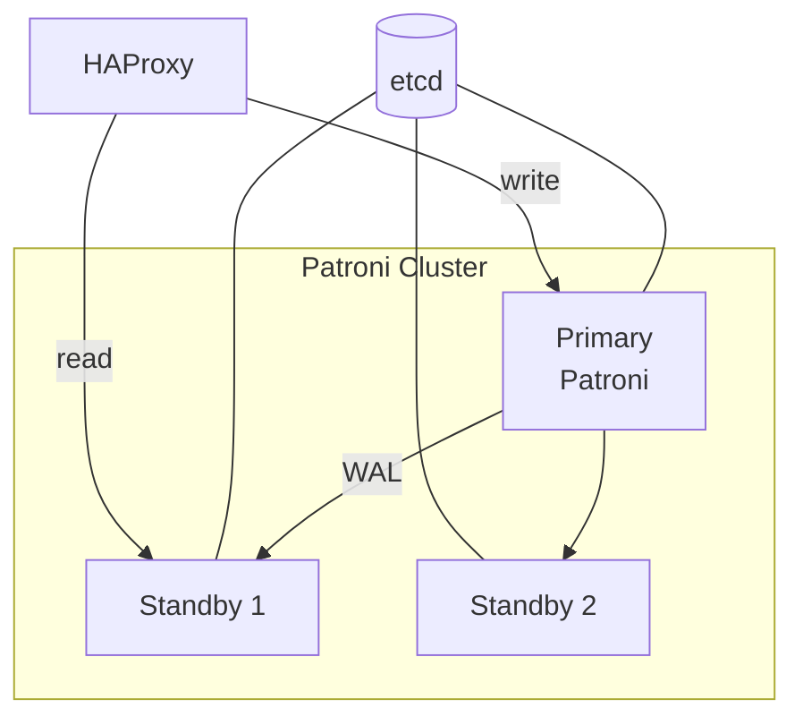

# Лекция 10. Отказоустойчивость и репликация PostgreSQL

**Неделя:** 10

---

## Цель лекции

По итогам лекции студент:

- понимает концепцию HA (High Availability) и ключевые метрики надёжности;
- знает принцип потоковой репликации PostgreSQL и умеет интерпретировать её состояние;
- понимает разницу между физической и логической репликацией;
- умеет описать требования к отказоустойчивости для передачи DBA.

---

## 1. Концепция HA: зачем нужна отказоустойчивость

Единственный сервер PostgreSQL (standalone) — единая точка отказа (SPOF). При его недоступности сервис недоступен.

**Метрики надёжности:**

| Метрика  | Расшифровка                                    | Пример                                   |
|----------|------------------------------------------------|------------------------------------------|
| **SLA**  | Service Level Agreement — договорной уровень доступности | 99.9% = ~8.7 ч простоя в год  |
| **MTBF** | Mean Time Between Failures — среднее время между отказами | 2000 ч                         |
| **MTTR** | Mean Time To Recovery — среднее время восстановления     | 30 мин                         |
| **RTO**  | Recovery Time Objective — допустимое время восстановления | 4 ч                            |
| **RPO**  | Recovery Point Objective — допустимая потеря данных      | 1 ч                            |

**Соответствие HA-схем уровням SLA:**

| Схема                             | Достижимый SLA         | RTO                |
|-----------------------------------|------------------------|--------------------|
| Standalone + бэкап                | 99.0–99.5%             | часы               |
| Primary + Hot Standby             | 99.9–99.95%            | минуты             |
| Primary + Standby + Patroni       | 99.99%                 | < 1 минуты         |

---

## 2. Потоковая репликация (Streaming Replication)

PostgreSQL передаёт WAL-записи с primary на один или несколько standby-серверов в режиме реального времени.


### 2.1. Настройка primary

```ini
# postgresql.conf
wal_level               = replica
max_wal_senders         = 5
wal_keep_size           = 1GB
```

```
# pg_hba.conf
host    replication     replication_user    10.0.0.2/32    scram-sha-256
```

```sql
CREATE ROLE replication_user REPLICATION LOGIN PASSWORD 'secret';
```

### 2.2. Инициализация standby

```bash
pg_basebackup -h 10.0.0.1 -U replication_user \
  -D /var/lib/postgresql/17/main \
  -Fp -Xs -P -R
# -R — создаёт standby.signal и primary_conninfo
```

### 2.3. Мониторинг репликации

```sql
-- На primary
SELECT client_addr, state, sent_lsn, write_lsn, flush_lsn, replay_lsn,
       replay_lag,   -- ключевая метрика: отставание реплики
       sync_state
FROM   pg_stat_replication;

-- На standby
SELECT pg_is_in_recovery();                  -- true
SELECT pg_last_xact_replay_timestamp();      -- время последней транзакции
```

`replay_lag` > 30 секунд — сигнал тревоги.

---

## 3. Hot Standby и синхронная репликация

```ini
# standby: разрешить read-only запросы
hot_standby = on

# primary: синхронная репликация (RPO = 0)
synchronous_standby_names = 'FIRST 1 (standby1, standby2)'
synchronous_commit        = on
```

| Режим               | RPO          | Производительность записи | Применение              |
|---------------------|--------------|---------------------------|-------------------------|
| Асинхронная (по умолчанию) | секунды | Нет снижения            | Большинство случаев     |
| Синхронная          | 0 (нет потери) | Снижение на сетевую задержку | Финансовые данные   |

---

## 4. Логическая репликация

Передаёт изменения на уровне строк — поддерживает разные версии PostgreSQL и выборочную репликацию таблиц.

```sql
-- Publisher
CREATE PUBLICATION orders_pub FOR TABLE orders, customers;

-- Subscriber (другой кластер)
CREATE SUBSCRIPTION orders_sub
  CONNECTION 'host=10.0.0.1 dbname=myapp user=replication_user password=secret'
  PUBLICATION orders_pub;
```

| Сценарий                                            | Логическая  | Физическая |
|-----------------------------------------------------|-------------|------------|
| Обновление мажорной версии (16 → 17)                | ✓           | —          |
| Реплицировать только отдельные таблицы              | ✓           | —          |
| Полное зеркало для failover                         | —           | ✓          |
| Standby для балансировки чтения                     | —           | ✓          |

---

## 5. Failover

### 5.1. Ручной failover

```bash
# На standby — повысить до primary
pg_ctl promote -D /var/lib/postgresql/17/main
```

```sql
-- PostgreSQL 12+
SELECT pg_promote();
```

### 5.2. Автоматический failover: Patroni



При падении primary Patroni проводит выборы через etcd и автоматически продвигает лучшего standby.

---

## 6. Требования к отказоустойчивости: шаблон для DBA

```markdown
## Требования к HA — production

### Бизнес-требования
- SLA: 99.9% (допустимо ~8.7 ч простоя в год)
- RTO: не более 30 минут
- RPO: не более 5 минут

### Топология
- Primary + 1 hot standby (минимум)
- Репликация: асинхронная
- Standby для read-only отчётов

### Мониторинг
- Алерт при replay_lag > 30 с
- Алерт при недоступности primary > 60 с
- Автоматический failover: Patroni (желательно)

### Тестирование
- Ежеквартальный плановый switchover
```

---

## 7. Итоги лекции

После этой лекции студент умеет:

- **Сформулировать HA-требования** для системы: допустимый RTO, RPO, SLA (9-ки доступности).
- **Объяснить схему потоковой репликации**: primary → standby, WAL, `replay_lag`, `pg_stat_replication`.
- **Сравнить синхронную и асинхронную репликацию**: RPO = 0 vs задержка записи.
- **Объяснить логическую репликацию** (`CREATE PUBLICATION / SUBSCRIPTION`) и когда она предпочтительнее физической.
- **Описать роль Patroni**: зачем нужен orchestrator, как он взаимодействует с etcd при failover.

---

## Ссылки

- Потоковая репликация: https://www.postgresql.org/docs/current/warm-standby.html
- Логическая репликация: https://www.postgresql.org/docs/current/logical-replication.html
- pg_stat_replication: https://www.postgresql.org/docs/current/monitoring-stats.html#MONITORING-PG-STAT-REPLICATION-VIEW
- Patroni: https://patroni.readthedocs.io
