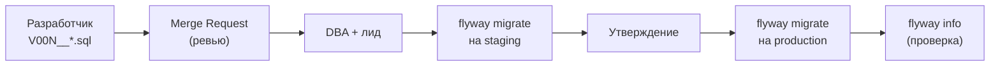

# Лекция 12. Версионирование схемы БД. Flyway. Migration Plan. Runbook

**Неделя:** 12

---

## Цель лекции

По итогам лекции студент:

- понимает, зачем версионировать схему базы данных;
- знает соглашения об именовании файлов Flyway и порядок применения миграций;
- умеет составить Migration Plan и Runbook для DBA;
- понимает MR-процесс для деплоя миграций.

---

## 1. Проблема: неуправляемые изменения схемы

| Без версионирования                            | С версионированием (Flyway)                         |
|------------------------------------------------|-----------------------------------------------------|
| «Кто добавил эту колонку?»                     | Git-история: кто, когда, зачем                      |
| Разные схемы в dev / staging / production      | Одинаковое состояние на всех средах                 |
| Боязнь деплоя в production                     | Автоматизированный, воспроизводимый процесс         |
| Откат вручную, по памяти                       | Явные undo-скрипты или forward rollback             |

Инструменты версионирования схемы: **Flyway** (Java-совместимый, TOML/CONF-конфиг) и **Liquibase** (XML/YAML). Курс использует Flyway.

---

## 2. Flyway: соглашения об именовании

| Тип       | Префикс | Пример                                  | Назначение                                      |
|-----------|---------|-----------------------------------------|-------------------------------------------------|
| Versioned | `V`     | `V003__add_orders_idx.sql`              | Применяется один раз; основной тип              |
| Undo      | `U`     | `U003__add_orders_idx.sql`              | Откат конкретной версии (Flyway Teams)          |
| Repeatable| `R`     | `R__refresh_mv_orders.sql`              | Применяется при изменении содержимого           |

**Важно:** разделитель — **двойное подчёркивание** (`__`). Одиночное — ошибка парсинга.

```
db/migration/
├── V001__init_schema.sql
├── V002__add_customer_email.sql
├── V003__add_orders_idx.sql
├── U003__add_orders_idx.sql
└── R__refresh_mv_orders.sql
```

---

## 3. Flyway: конфигурация

```toml
# flyway.toml
[flyway]
url       = "jdbc:postgresql://localhost:5432/myapp_prod"
user      = "flyway_user"
password  = "${FLYWAY_PASSWORD}"

locations = ["filesystem:db/migration"]
schemas   = ["public"]

cleanDisabled     = true    # ОБЯЗАТЕЛЬНО в production!
baselineOnMigrate = false
outOfOrder        = false
```

---

## 4. Команды Flyway

```bash
flyway migrate    # применить pending-миграции
flyway info       # показать статус миграций
flyway validate   # проверить целостность (checksum файлов vs БД)
flyway repair     # исправить failed-запись после ручного исправления
flyway clean      # удалить все объекты (только dev!)
flyway baseline   # создать baseline для существующей БД
```

---

## 5. Таблица истории: flyway_schema_history

```sql
SELECT version, description, script, checksum,
       installed_on, success
FROM   flyway_schema_history
ORDER  BY installed_rank;
```

| Поле       | Значение                                                      |
|------------|---------------------------------------------------------------|
| `version`  | Номер версии из имени файла                                   |
| `success`  | `true` — OK; `false` — ошибка (нужен `flyway repair`)        |
| `checksum` | Если файл изменён — `flyway validate` провалится              |

---

## 6. MR-процесс для миграций



**Чек-лист для MR с миграцией:**
- [ ] Имя файла: V + двойное подчёркивание
- [ ] Транзакция явно обозначена или операция идемпотентна
- [ ] Для деструктивных операций есть undo-скрипт или план rollback
- [ ] Нет `flyway clean` без согласования
- [ ] Миграция прошла на staging без ошибок
- [ ] `flyway validate` на staging — OK

---

## 7. Migration Plan

```markdown
## Migration Plan: V003__add_orders_status_idx

### Цель
Добавить индекс по `orders.status` для ускорения выборок активных заказов.

### Скрипт
```sql
CREATE INDEX CONCURRENTLY idx_orders_status ON orders(status)
WHERE status IN ('pending', 'processing');
```

### Анализ влияния
- orders: 3.2 млн строк
- Время: 5–15 минут (CONCURRENTLY — без блокировки DML)
- Привилегии: CREATE INDEX для flyway_user — есть
- Размер: +~200 МБ

### Окно обслуживания
Не требуется (CONCURRENTLY).

### Rollback
```sql
DROP INDEX CONCURRENTLY idx_orders_status;
```

### Критерии успеха
- flyway info: версия 003 — Success
- `\d orders` содержит idx_orders_status
```

---

## 8. Runbook для деплоя миграции

```markdown
## Runbook: деплой миграций в production

### Подготовка (за 30 минут)
1. `flyway info` на staging — всё Success
2. Предупредить поддержку о временном окне
3. Бэкап: pg_dump -Fc myapp_prod -f pre_migration_$(date +%Y%m%d_%H%M).dump

### Выполнение
1. `flyway info` — зафиксировать состояние
2. `flyway migrate`
3. `flyway info` — убедиться, что всё Success
4. Smoke-тест приложения

### Rollback (при ошибке)
1. `flyway repair` — сбросить failed-запись
2. Выполнить undo-скрипт вручную
3. `flyway repair` ещё раз

### Контакты
- DBA on-call: [контакт]
- Лид разработки: [контакт]
```

---

## 9. Итоги лекции

После этой лекции студент умеет:

- **Создать Flyway-проект**: `flyway.toml` с `cleanDisabled=true`, структуру папки `migrations/`.
- **Написать корректный V-файл**: двойное подчёркивание в имени, идемпотентность через `IF NOT EXISTS`.
- **Выполнить полный цикл**: `flyway baseline` → `migrate` → `info` → `validate` → `repair`.
- **Составить Migration Plan**: таблица изменений, rollback-SQL, чек-лист до деплоя.
- **Написать Runbook**: подготовка → выполнение → проверка → откат — и объяснить каждый шаг.

---

## Ссылки

- Flyway: https://flywaydb.org/documentation
- SQL Migrations: https://flywaydb.org/documentation/concepts/migrations#versioned-migrations
- Flyway Configuration: https://flywaydb.org/documentation/configuration/configfile
